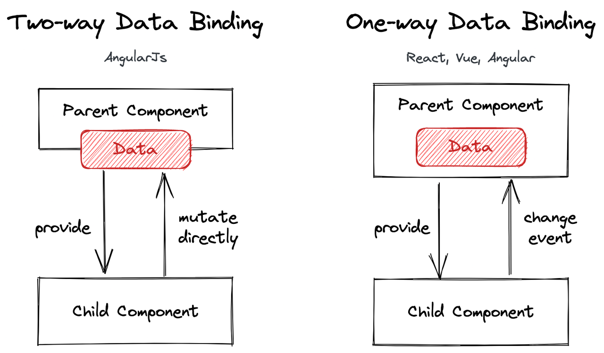
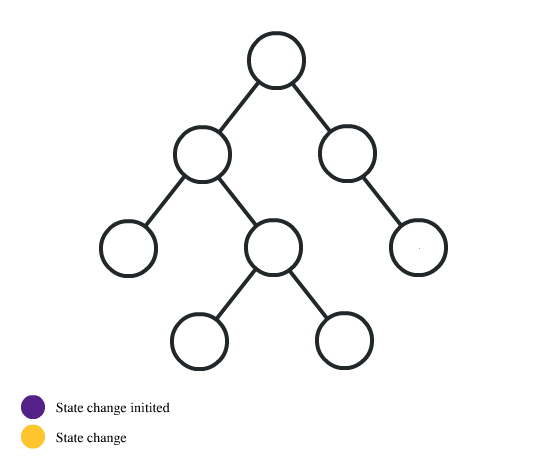

# React 팀과제, React 생명주기, Redux

## 리액트 팀과제

### 1번 문제

```
자바스크립트에서 유사배열과 배열의 차이는 무엇일까요?
유사배열의 각 요소를 수정하고 싶다면 어떤 과정을 거쳐야할까요?
```

유사 객체 배열은 배열처럼 보이지만 사실 key가 숫자이고 length 값을 가지고 있는 객체를 말한다. JS에서 querySelectorAll이나 document.body.children으로 엘리먼트를 가져오면 유사 배열 객체에 담겨서 온다.

자바스크립트에서 객체 안의 프로퍼티를 참조할때 obj.key와 같은 형식으로 참조해도 되지만 obj\['key'\]와 같이 배열과 비슷한 방식으로 내부의 프로퍼티를 참조할 수 있다. 이를 이용해서 키값을 숫자로 줌으로써 배열과 비슷하게 작동하도록 만든 것이 유사배열이다. 즉, 유사 배열은 배열같이 생겼지만 사실은 객체이다.

따라서 유사 배열은 배열의 forEach, map, filter, reduce와 같은 함수를 사용할 수 없다.

유사 배열은 어떤 함수에서 결과값으로 배열값을 리턴해주고 싶을 때나, 원래의 배열객체가 가지고 있는 함수들을 사용하고 싶지 않을 때, 원래 배열에 없는 기능을 제공하고 싶을 때 이용된다.

그렇다면 유사배열이 갖추어야할 조건엔 어떤 것이 있을까?

1. 반드시 length가 필요해야한다. 이 조건은 필수, 없으면 유사배열이라고 인식하지 않는다.

2. index번호가 0번부터 시작해서 1씩증가해야한다. 안 그래도 되긴 하는데 예상치 못한 결과가 생긴다.

유사 배열의 각 요소를 수정하고 싶다면 arr\[index\] = value와 같이 배열과 같은 방식으로 수정할 수 있다.

만약에 유사배열에 Array객체에 내장되어있는 함수들을 사용하고 싶다면, Array.from()메소드를 이용해 유사배열 객체를 배열로 변환하여 반환된 배열을 이용하거나, 혹은 call, apply와 같은 간접호출 메소드를 이용해야한다. 

<b>간접호출</b>

```javascript
function sum() {
  //arguments 객체를 배열로 변환(간접호출)
  const array = Array.prototype.slice.call(arguments);
  return array.reduce(function (pre, cur) {
    return pre + cur;
  }, 0);
}
console.log(sum(1, 2)); //3
console.log(sum(1, 2, 3)); //6
```

<b>Array.from</b>

```javascript
function sum() {
  realArray = Array.from(arguments);
  return realArray.reduce((pre, cur) => pre + cur, 0);
}
console.log(sum(1, 2)); //3
console.log(sum(1, 2, 3)); //6
```
***
### 2번 문제

```
부모 컴포넌트 A와 자식 컴포넌트 B가 있습니다.
컴포넌트 A는 state로 {name: "르탄이"}를 가지고 있고, 자식인 컴포넌트 B에게 name 값을 넘겨주었습니다.
컴포넌트 B는 받아온 name을 화면에 뿌려주고 있습니다.
컴포넌트 A의 state가 {name: "진도사우르스"}로 바뀌었을 때, 어떤 과정을 거쳐 바뀐 값을 화면에 보여주는 지 라이프 사이클 흐름을 그려볼까요?
```

컴포넌트는 생성(mounting), 업데이트(updating), 제거(unmounting)의 생명주기를 갖는다. 리액트 클래스 컴포넌트는 라이프사이클 메서드를 사용하고, 함수형 컴포넌트는 Hook을 사용해 특정 라이프 사이클 지점에서 코드를 호출할 수 있다.

위의 경우에는 컴포넌트가 이미 존재한다고 가정하였고, 컴포넌트를 삭제하지 않았기 때문에 업데이트 라이프 사이클만 고려하면 된다. 리액트에서 업데이트가 발생하는 경우는 다음의 네 가지이다.

1. props가 바뀔 때
2. state가 바뀔 때
3. 부모 컴포넌트가 리렌더링 할 때
4. this.forceUpdate로 강제 렌더링을 트리거 할 때

처음, 컴포넌트 A의 state가 바뀌었으므로 A가 리렌더링 된다. A가 리렌더링 되면 B에 새로운 props를 내려주기 때문에 B도 리렌더링된다. 

렌더 단계에 들어가면 새로운 가상 DOM을 생성한 뒤 이전 가상 DOM과 비교하여 실제 DOM에 반영할 부분을 결정한다. 이후 커밋 단계에서 달라진 부분만 실제 DOM에 반영한다. 위 상황에서는 컴포넌트 B에서 달라진 name을 화면에 뿌려주는 부분이 실제 DOM에 반영될 것이다.

브라우저가 화면에 Paint하기 전에, useLayoutEffect에 등록해둔 effect가 있다면 실행한다. 이 때 state, redux store등의 변경이 있다면 한번 더 재렌더링 된다.

이후 Paint과정에서 브라우저가 실제 DOM을 화면에 그리게 되면 끝나게 된다.

만일 각 컴포넌트에 다음과 같은 생명주기 메소드들이 존재한다면, 메소드들이 해당하는 시점에 실행 될 것이다. 그러나 위 문제에서는 별개의 언급이 없어 추가하지 않았다.

1. getDerivedStateFromProps()

	업데이트 단계에서 가장 먼저 호출되는 메소드이다. 초기 props에 기반한 state가 저장되는 곳이다. 주로 props의 변화에 따라 state값에도 변화를 주고 싶을 때 사용한다.

2. shouldComponentUpdate()

	React가 렌더링을 계속해야하는지 마는지에 대한 진리값을 반환하다. 기본값은 true이고 false를 리턴하면 컴포넌트는 업데이트 되지 않는다.

3. render()

	모든 클래스형 컴포넌트가 반드시 가져야 하는 메소드이다. 컴포넌트가 업데이트 되면 render()함수가 호출되고 새로운 변경점들을 갖고 리렌더링 된다.

4. getSnapshotBeforeUpdate()

	render에서 만들어진 결과물이 브라우저에 실제로 반영되기 직전 호출된다. 그러므로 업데이트 되기 전의 props와 state에 접근할 수 있다.

5. componentDidUpdate()

	컴포넌트의 업데이트 작업이 끝난 후 호출되는 메소드이다.
***
### 3번 문제

```
양방향 바인딩은 무엇일까요? 
양방향 바인딩을 사용하는 경우 리렌더링이 어떻게 이루어질 지 그려보세요.
(부모 컴포넌트 A와 자식 컴포넌트 B가 있음을 가정하고 그려봅시다.)
```



양방향 바인딩에서는 부모 컴포넌트와 자식 컴포넌트간에 데이터가 서로 양방향으로 흐른다. 부모와 자식 모두 데이터를 직접 변경할 수 있다.

model(JavaScript)과 view(HTML)가 있을 때, 양방향 데이터 바인딩은 model이 업데이트 되면 view가 업데이트 되고, 반대로 view가 업데이트되면 model이 업데이트 되는 것이다.

리액트에서의 양방향 바인딩은, 자식 컴포넌트에서 event가 발생할 때 부모 컴포넌트에서 전달한 핸들러를 통해 부모 컴포넌트의 state를 바꾸어 양방향 바인딩과 같은 동작이 일어나게 함으로써 작동한다. 이를 state 끌어올리기(lifting state up)이라고 한다.

자식 컴포넌트 B에서 state 끌어올리기를 통해 부모 컴포넌트의 state를 변경시키면, 부모 컴포넌트가 리렌더링 되고 부모 컴포넌트가 리렌더링 되었으므로 자식 컴포넌트도 리렌더링된다. 

그러나 리액트에서 양방향 바인딩 사용은 권장되지 않는다. 넘겨주는 데이터가 부모에서 바뀌고, 그것이 다시 자식 컴포넌트로 내려보내는 props 값이고, 그것이 event를 발생시켜 핸들러를 호출한다면 무한 루프에 빠지게 될 수 있다.

또한 컴포넌트의 구조가 복잡해진다면 유지보수가 힘들어지고, 자식 컴포넌트에서 부모 컴포넌트의 state를 변경하는 경우 해당 state 변수를 갖고있는 부모 컴포넌트까지 리렌더링이 일어나므로 효율적이지 못하다.



말단 컴포넌트에서 발생한 state change가 root 컴포넌트까지 올라가서 전체 페이지를 리렌더링 시키는 모습을 볼 수 있다. 이런 상황을 방지하기 위해서 redux와 같은 상태변화 라이브러리들을 사용한다.
***
### 4번 문제

```
event listener는 등록되면 반드시 해제되어야 합니다.
클래스형 컴포넌트에서는 컴포넌트가 화면에서 사라질 때(unmount 될 때) event listener를 해제합니다. (componentWillUnmount에서요!)
그럼 라이프사이클 메소드를 사용할 수 없는 함수형 컴포넌트에서는 event listener를 해제할 때 어떻게 해야할까요?
```

리액트에서는 함수형 컴포넌트에서 클래스형 컴포넌트의 componentDidMount와 componentDidUpdate, componentWillUnmount 메소드처럼 동작하는 `useEffect()`라는 Hook을 지원한다. useEffect는 dependency를 선언하여 함수의 호출 시점을 구분한다.

`useEffect()`함수는 렌더단계가 아닌 리액트가 DOM을 업데이트 하고 난 뒤에 실행되므로, 위의 세 가지 생명 주기 메소드를 제외한 다른 생명 주기 메소드들은 대체할 수 없다. (리액트측에서 함수형 컴포넌트에서 생명주기 메소드를 대체할 수 있는 Hook을 추가할 예정이라고 한다.)

<b>useEffect()의 기본 형태</b>

useEffect(function, deps)

- function: 수행하고자 하는 작업
- deps: 배열 형태이며 배열 안에는 검사하고자 하는 특정 값 or 빈 배열 or 생략

<b>1. 컴포넌트가 mount 됐을 때 (componentDidMount)</b>

```javascript
useEffect(() => {
	console.log("마운트 될 때만 실행된다")
}, []);
```

deps 배열에 빈 배열을 전달하면 컴포넌트가 mount됐을 때만 실행된다.

<b>2. state, props가 update 됐을 때</b>

```javascript

const mounted = useRef(false);

useEffect(() => {
	if(!mounted.current){
		mounted.current = true;
	} else{
		// do something...
	}
}, [바뀌는 값]);
```

deps 배열에 값을 넣으면 해당 props, state가 변경될 때 마다 useEffect 첫 번째 인자로 전달한 함수가 실행된다.

deps 배열에 값을 넣어도 처음 마운트될 때 함수가 실행된다. 따라서 위와같이 mounted 변수를 이용하면 해당 변수가 변경 될 때에만 useEffect가 실행된다.

<b>3. 컴포넌트가 리렌더링 됐을 때 (componentDidUpdate)</b>

```javascript
useEffect(() => {
	// do something..
});
```

deps 배열을 생략하면, 컴포넌트가 리렌더링 됐을 때 useEffect 함수가 호출된다, 즉 `componentDidUpdate()`함수처럼 사용할 수 있다.

<b>4. 컴포넌트가 unmount 됐을 때 (componentWillUnmount)</b>

```javascript
useEffect(() => {
	// do something...
	
	return () => {
		// 실행할 함수
	}
}, []);
```

deps 배열로 빈 배열을 주고, 함수의 return값에 실행할 함수를 작성하면 컴포넌트가 unmount될 때 해당 함수가 실행된다. 즉 useEffect를 `componentWillUnmount()`메소드처럼 사용할 수 있다.

만약 빈 배열을 주지 않고 배열의 인자로 props나 state의 값을 넘기면 해당 값이 바뀌기 직전에 실행된다.

그럼, 문제에서와 같이 event listener를 해제하는 방법을 알아보자.

```javascript
useEffect(() => {
    document.addEventListener();
  
  	return () => {
      document.removeEventListener();
    }
  }, [])
```

인자를 빈 배열로 전달해 처음 마운트 될 때 이벤트 리스너를 추가한다. 이후 return에서 이벤트 리스너를 제거하는 함수를 불러와 컴포넌트가 언마운트 될 때 이벤트 리스너를 제거한다.

### 5번 문제

```
리액트에서는 DOM 요소에 접근하기 위해 주로 ref를 씁니다.
domcument.getElementsByClassName 등을 쓰는 게 아니라 ref를 쓰는 이유는 무엇일까요?
```

리액트는 실제 DOM을 사용하는 것이 아니라 가상 DOM을 사용하기 때문에 실제 DOM의 문서 객체를 불러오는 domcument.getElementsByClassName이 아니라 `useRef()`를 통하여 문서 객체에 접근해야한다.

<b>ref 사용법</b>

```javascript
const nameInput = useRef();

// do something...

<input 
  name="name" 
  placeholder="이름" 
  onChange={onChange} 
  value={name}
  ref={nameInput} //이렇게 설정
/>
```

nameInput을 useRef()로 초기화해주고, 접근하고싶은 DOM 속성에 ref={nameInput}을 추가하면 nameInput을 이용해 해당 DOM에 접근할 수 있게 된다.

```javascript
const onReset = () => {
  setInputs({
    name: '',
    nickname: '',
  });

  nameInput.current.focus(); //이렇게 접근할 수 있다.
```

`nameInput.current.focus();` 를 해석해보면,

`nameInput.current` 까지가 해당 DOM을 가리키게 되고,

그 다음 DOM API 중 하나인 `focus()` 함수를 호출해 오는 코드이다.

<b>왜 ref를 사용해야 하는가</b>

ref를 사용하는 방식이 `document.getElement`류의 함수보다 더 적절하다. `document.getElement`는 실제 DOM에서 해당 조건에 맞는 문서 객체를 가져오는데, 리액트에서는 다른 컴포넌트에서 같은 이름을 가진 문서 객체가 존재할 수 있다. (리액트는 가상 DOM을 실제 DOM에 적용시킬 때 랜덤한 문자열을 추가하는 방식으로 이를 해결한다)

예를 들면, 컴포넌트 A에 `id = "nameInput"`을 가진 문서 객체가 존재하고, 컴포넌트 B에도 `id = "nameInput"`을 가진 문서 객체가 존재한다고 생각해보자.

위의 경우 `document.getElementById("nameInput")`을 호출하면 문제가 생긴다. id가 중복되므로 어떤 문서 객체를 가져와야 할 지 모르기 때문이다!

또한 ref를 사용함으로써 내가 정한 스코프 안에서만 ref에 접근할 수 있게 한다. 따라서 컴포넌트 바깥에 있는 데이터에 접근하기 위해 props와 state를 사용해야 하므로, 리액트의 단방향 데이터 흐름을 방해하지 않게 만들어 코드를 좀 더 유지보수하기 쉽게 만든다.

### 6번 문제

```
SPA 방식과 MPA 방식은 무엇인가요?
```

<b>SPA란?</b>

SPA는 `Single Page Application`의 약자로 단일 페이지 애플리케이션을 의미한다.

어느 사이트에 들어갔을 때 보여지는 페이지를 브라우저에 최초로 한번만 load하고, 이후부터는 변화가 나타나는 부분에서만 데이터를 binding하는 방식으로 동작한다.

기존의 애플리케이션들은 화면을 이동할 때 필요한 데이터를 서버측에서 전달받고 페이지를 처음부터 다시 load하기 때문에 시간이 오래 걸리지만, SPA는 HTML을 다시 불러오지 않고, 페이지 갱신에 필요한 데이터만 서버에서 받아 페이지를 갱신한다.

그래서 SPA는 `CSR(Client Side Rendering)` 방식으로 렌더링된다.

<b>SPA의 장점</b>

1. SPA방식은 전체 페이지를 업데이트 할 필요가 없기 때문에 빠르고 페이지를 로딩할 때 깜빡이지 않는다. 또한 필요한 리소스만 부분적으로 로딩하고, 받은 데이터는 캐시에 저장해 놓기 때문에 성능측면에서 효율적이다.

2. 또한 서버의 템플릿 연산을 클라이언트로 분산하고, 컴포넌트별 개발이 용이하다는 등의 장점이 있다.

<b>SPA의 단점</b>

1. 자바스크립트 파일을 한 번에 받기 때문에 초기 구동 속도가 느리다. 또한 검색엔진최적화(SEO)가 어렵다.

<b>MPA란?</b>

MPA는 `Multiple Page Application`의 약자로 페이지가 요청될 때 마다 서버에서 렌더링 된 정적 리소스(HTML, CSS, JavaScript)가 다운로드된다.

페이지를 이동하거나 새로고침하면 전체 페이지를 다시 렌더링한다.

MPA는 `SSR(Server Side Rendering)` 방식으로 렌더링된다.

<b>MPA의 장점</b>

1. MPA는 완성된 형태의 HTML파일을 서버로부터 전달받으므로 검색엔진이 페이지를 크롤링하기에 적합하다. 즉 검색엔진최척화 관전에서 유리하다.

2. 서버에서 페이지를 렌더링해 가져오므로 첫 로딩이 매우 짧다. 그러나 클라이언트가 JS파일을 모두 다운로드하고 적용하기 전 까지는 각각의 기능은 동작하지 않는다.

<b>MPA의 단점</b>

1. 매 페이지마다 새로고침이 발생하기 때문에 새로운 페이지를 이동하면 깜빡인다.

2. 페이지 이동시 불필요한 템플릿도 중복해서 로딩한다.

3. 렌더링이 서버측에서 일어나므로 부하가 발생할 수 있다.

4. 모바일 앱 개발시 추가적인 백엔드 작업이 필요하다.

## React 생명주기

React의 각 컴포넌트는 Mounting, Updating, Unmounting 세 개의 주요 단계를 통해 주기를 관리하고 관찰할 수 있다.


### Mounting

Mounting은 DOM에 요소를 붙이는 것을 의미한다. React는 컴포넌트를 마운팅 할 때 순서대로 4가지 내장 메소드를 호출하게 된다.

1. `constructor()`
2. `getDerivedStateFromProps()`
3. `render()`
4. `componentDidMount()`

render()메소드는 반드시 호출되어야하고, 다른 메소드들은 선택적으로 호출 될 수 있다.

<b>1. constructor</b>

`constructor()` 메소드는 컴포넌트가 초기화될 때 다른 어떤 메소드보다 먼저 호출되며, state 와 다른 초기 값들을 세팅한다.

`constructor()` 메소드는 props 라고도 불리며, `super(props)` 를 가장 먼저 호출해야 한다. `super(props)` 는 부모의 constructor 메소드를 초기화하고, 부모로 부터 상속받은 메소드들을 컴포넌트로 하여금 사용할 수 있도록 해준다.

```javasript
class Header extends React.Component {
  constructor(props) {
    super(props)
    this.state = { favoritecolor: 'red' }
  }
  render() {
    return <h1>My Favorite Color is {this.state.favoritecolor}</h1>
  }
}

ReactDOM.render(<Header />, document.getElementById('root'))
```
- Header 컴포넌트는 `constructor()` 를 통해 React.Component를 상속 받아 상속 받은 props와 state값을 저장한다.
- state 객체의 초기값은 favoritecolor 속성을 "red"로 지정한다.

<b>2. getDerivedStateFromProps</b>

`getDerivedStateFromProps()` 메소드는 DOM에서 요소들이 렌더링 되기 직전에 호출된다.

최초의 props로 받아 온 값을 state에 동기화 시키는 용도로 사용된다.

```javascript
class Header extends React.Component {
  constructor(props) {
    super(props)
    this.state = { favoritecolor: 'red' }
  }
  static getDerivedStateFromProps(props, state) {
    return { favoritecolor: props.favcol }
  }
  render() {
    return <h1>My Favorite Color is {this.state.favoritecolor}</h1>
  }
}

ReactDOM.render(<Header favcol="yellow" />, document.getElementById('root'))

```

- `getDerivedStateFromProps()` 는 props와 state를 인자로 받아 props의 favcol 값을 state의 favoritecolor 속성 값으로 세팅한다.

<b>3. render</b>

`render()` 메소드는 필수값이며, DOM에 HTML을 표현해준다.

```javascript
class Header extends React.Component {
  render() {
    return <h1>This is the content of the Header component</h1>
  }
}

ReactDOM.render(<Header />, document.getElementById('root'))
```

- `render()` 함수로 반환되는 html을 root DOM에 표현한다.

<b>4. componentDidMount</b>

`componentDidMount()` 메소드는 컴포넌트가 렌더링된 직 후에 호출된다.

이미 DOM에 위치한 컴포넌트를 필요로 하는 구문을 사용하는 곳이다.

```javascript
class Header extends React.Component {
  constructor(props) {
    super(props)
    this.state = { favoritecolor: 'red' }
  }
  componentDidMount() {
    setTimeout(() => {
      this.setState({ favoritecolor: 'yellow' })
    }, 1000)
  }
  render() {
    return <h1>My Favorite Color is {this.state.favoritecolor}</h1>
  }
}

ReactDOM.render(<Header />, document.getElementById('root'))
```

- `componentDidMount()` 를 통해 Header 컴포넌트가 렌더링 된 직후 1초 후에 state 값을 변경한다. (red에서 yellow로)

### Updating

그 다음 단계인 Updating은 컴포넌트가 업데이트 할 때를 의미한다. 컴포넌트는 state나 props가 변경될 때 마다 업데이트 된다

5가지 내장 메소드가 있고, 컴포넌트가 업데이트 되면 순서대로 실행된다.

1. `getDerivedStateFromProps()`
2. `shouldComponentUpdate()`
3. `render()`
4. `getSnapshotBeforeUpdate()`
5. `componentDidUpdate()`

update 단계에서 가장 먼저 `getDerivedStateFromProps` 메소드가 호출된다. props로 받아 온 값을 state에 동기화 시키는 용도로 사용된다.

```javascript
class Header extends React.Component {
  constructor(props) {
    super(props)
    this.state = { favoritecolor: 'red' }
  }
  static getDerivedStateFromProps(props, state) {
    return { favoritecolor: props.favcol }
  }
  changeColor = () => {
    this.setState({ favoritecolor: 'blue' })
  }
  render() {
    return (
      <div>
        <h1>My Favorite Color is {this.state.favoritecolor}</h1>
        <button type="button" onClick={this.changeColor}>
          Change color
        </button>
      </div>
    )
  }
}

ReactDOM.render(<Header favcol="yellow" />, document.getElementById('root'))
```

- 위 컴포넌트에서 버튼을 클릭하면 onClick 이벤트로 favoritecolor를 ‘blue’로 변경해주지만, update 직후 실행되는 `getDerivedStateFromProps` 메소드로 인해 props.favcol로 전달받은 ‘yellow’가 여전히 state 값으로 남아있게 된다.

<b>2. shouldComponentUpdate</b>

`shouldComponentUpdate()` 메소드는 React가 렌더링을 계속해야하는지 마는지에 대한 Boolean 값을 반환한다. 기본 값은 `true`이다.

```javascript
class Header extends React.Component {
  constructor(props) {
    super(props)
    this.state = { favoritecolor: 'red' }
  }
  shouldComponentUpdate() {
    return false
  }
  changeColor = () => {
    this.setState({ favoritecolor: 'blue' })
  }
  render() {
    return (
      <div>
        <h1>My Favorite Color is {this.state.favoritecolor}</h1>
        <button type="button" onClick={this.changeColor}>
          Change color
        </button>
      </div>
    )
  }
}

ReactDOM.render(<Header />, document.getElementById('root'))
```

- 위 컴포넌트에서 `shouldComponentUpdate()` 값이 false로 되어 있으므로 컴포넌트는 업데이트 되지 않는다.

<b>3. render</b>

컴포넌트가 업데이트 되면 역시 `render()` 도 호출된다. 새로운 변경점들을 갖고 리렌더링 된다.

<b>4. getSnapshotBeforeUpdate, 5. componentDidUpdate</b>

`getSnapshotBeforeUpdate()` 메소드는 업데이트 되기 전의 props와 state에 접근할 수 있다. 즉, update 이후에도 update 이전의 값들을 확인할 수 있다는 것을 의미한다.

만약 `getSnapshotBeforeUpdate()` 메소드가 존재하면, `componentDidUpdate()` 메소드도 포함해야 한다. 그렇지 않으면 에러가 발생한다.

`componentDidUpdate()` 메소드는 컴포넌트가 DOM에서 update된 후에 호출된다.

```javascript
class Header extends React.Component {
  constructor(props) {
    super(props)
    this.state = { favoritecolor: 'red' }
  }
  componentDidMount() {
    setTimeout(() => {
      this.setState({ favoritecolor: 'yellow' })
    }, 1000)
  }
  getSnapshotBeforeUpdate(prevProps, prevState) {
    document.getElementById('div1').innerHTML =
      'Before the update, the favorite was ' + prevState.favoritecolor
  }
  componentDidUpdate() {
    document.getElementById('div2').innerHTML =
      'The updated favorite is ' + this.state.favoritecolor
  }
  render() {
    return (
      <div>
        <h1>My Favorite Color is {this.state.favoritecolor}</h1>
        <div id="div1"></div>
        <div id="div2"></div>
      </div>
    )
  }
}

ReactDOM.render(<Header />, document.getElementById('root'))
```

- 초기값이 ‘red로 렌더링 되면, `componentDidMount()` 메소드에 의해 1초 후 값이 ‘yellow’로 업데이트 되고, 그 다음에 `getSnapshotBeforeUpdate()` 메소드가 실행되며 div1에 해당 텍스트가 출력된다.
- 업데이트 이전 내역을 표시해 주었으므로 업데이트 이후도 실행되야 하기 때문에 `componentDidUpdate()` 가 포함되어야 한다.

### Unmounting

Mount의 반대과정, 즉 컴포넌트를 DOM에서 제거하는 것을 `Unmount` 라고 한다.

언마운트시 호출되는 메소드는 `componentWillUnmount` 하나이다.

<b>1. componentWillUnmount</b>

컴포넌트가 언마운트되기 전에 호출되는 메소드이다. 이벤트 리스너를 제거할 때와 같이 정리가 필요할 때 사용한다.

## Redux
