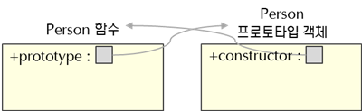
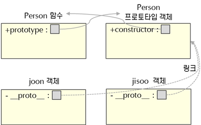
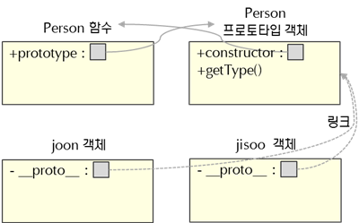
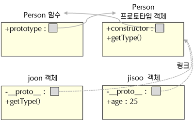
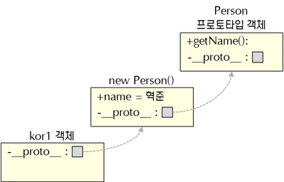
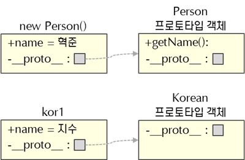
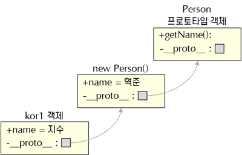
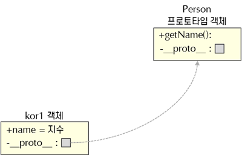

# 프로토타입, 상속

## 프로토타입과 상속

### 프로토타입

자바스크립트는 클래스개념이 없는 언어이다. 그래서 기존의 객체를 복사하여 새로운 객체를 생성하는, 프로토타입 기반의 방식을 사용한다. 프로토타입 기반 언어는 객체 원형인 프로토타입을 이용해 새로운 객체를 만들어내고, 이렇게 생성된 객체 역시 다른 객체의 원형이 될 수 있다. 프로토타입은 객체지향적인 프로그래밍을 할 수 있게 해준다.



```javascript
function Person(){};
```
자바스크립트에서는 함수를 정의하면 내부에 prototype 변수가 생긴다. 이 변수는 함수 이름의 프로토타입 객체를 참조하고, 프로토타입 객체의 멤버인 constructor 변수는 함수를 참조하는 내부구조를 가진다.



```javascript
function Person(){};
var joon = new Person();
var jisoo = new Person();
```

여기서 함수의 prototype 속성이 참조하는 프로토타입 객체는 new 연산자와 person함수를 통해 생성된 모든 객체의 원형이 되는 객체이다. 

또한 생성된 모든 객체들은 __proto__ 속성을 통해 프로토타입 객체를 참조한다.

자바스크립트에선 boolean, number, string, null, undefined를 제외하고는 모두 객체이다. 객체 안에는 __proto__라는 속성이 있고 원형인 프로토타입 객체를 참조한다.

모든 객체는 자신의 프로토타입 객체에 접근할 수 있고 프로토타입 역시 객체이므로 동적으로 런타임에 멤버를 추가할 수 있다. 또한 같은 프로토타입을 복사해 생성된 모든 객체는 추가된 멤버를 사용할 수 있다.



```javascript
function Person(){};
var joon = new Person();
var jisoo = new Person();

Person.prototype.getType = function(){
	return "사람";
}

console.log(joon.getType()) // 사람
console.log(jisoo.getType()) // 사람
```
prototype을 이용해 getType()함수를 추가했지만 추가하기 이전의 joon과 jisoo객체에서도 getType이 사용 가능하다.
또한 프로토타입 객체에 멤버를 추가,수정,삭제할때는 함수 안의 prototype속성을 사용해야한다. 하지만 prototype 객체를 읽을 때는 함수 안의 prototype속성 또는 객체 이름으로 접근해야한다.



```javascript
joon.getType = function(){
	return "인간"
}

console.log(joon.getType()) // 인간
console.log(jisoo.getType()) // 사람

jisoo.age = 25;

console.log(joon.age) // undefined
console.log(jisoo.age) // 25
```

joon의 getType()을 수정하였고, joon에는 getType()이라는 메소드가 존재하므로 joon.getType()을 호출하면 joon의 getType이 호출된다. 반대로 jisoo에는 getType()이 없으므로 __proto__에 참조되어있는 protoType객체의 getType()이 호출된다.

jisoo에 age 속성을 추가하고 joon.age를 출력하면 joon과 프로토타입 모두 age라는 속성이 없으므로 undefined가 출력된다. 그러나 jisoo는 age속성을 가지고 있으므로 25가 출력된다.

### 상속

크게 두 가지의 방식으로 상속이 가능하다. 하나는 new를 이용한 classical 방식이고 다른 하나는 Object.create()를 이용한 prototypal이다.

1. 기본 방법



```javascript
function Person(name){
    this.name = name || "혁준";
}

Person.prototype.getName = function(){
    return this.name;
}

function Korean(name){}

Korean.prototype = new Person();

var kor1 = new Korean();
console.log(kor1.getName());

var kor2 = new Korean("지수");
console.log(kor1.getName());
```

kor1객체의 __proto__를 new Person()객체로 지정하고, Person 프로토타입 객체에 getName()메소드를 추가한 상황이다.

kor2에 지수라는 인자를 전달하였으나 getName()으로 name을 부르면 혁준이 반환된다. 이는 자식 객체를 생성할 때 인자를 넘겨도 부모 객체를 생성할때 인자를 넘겨 줄 수 없어 기본값인 혁준이 this.name에 저장되기 때문이다. 객체를 생성할 때 마다 부모의 함수를 호출할 수도 있으나 이는 매우 비효율적이다.

또한 이 방식은 부모 객체의 속성과 부모 객체의 프로토타입 속성 모두를 물려받게 된다. 대부분의 경우 객체 자신의 속성은 특정 인스턴스에 한정되어 재사용할 수 없어 필요가 없다.

2. 생성자 빌려 쓰기




```
function Person(name){
    this.name = name || "혁준";
}

Person.prototype.getName = function(){
    return this.name;
}

function Korean(name){
    Person.apply(this, arguments);
}

var kor1 = new Korean("지수");
console.log(kor1.name) // 지수
```

Korean함수 내에서 apply함수를 이용해 Person함수 영역의 this를 Korean함수 안의 this로 바인딩했다. 이를 통해 부모의 속성을 자식 함수 안에 모두 복사할 수 있게 되었다. 객체를 생성 할 때 Person에 인자를 넘겨주므로 kor1.name에 지수가 저장 된 것을 볼 수 있다.

그러나 이 방법은 부모 객체의 생성자를 이용하여 부모 객체 멤버를 복사하여 자신의 것으로 만들 뿐 이므로 kor1 객체의 __proto__는 Korean의 프로토타입 객체를 참조하고있다. 이는 Person의 프로토타입 객체의 멤버들을 물려받지 못한다는 것을 의미한다.

3. 생성자 빌려 쓰고 프로토타입 지정해주기



```
function Person(name){
    this.name = name || "혁준";
}

Person.prototype.getName = function(){
    return this.name;
}

function Korean(name){
    Person.apply(this, arguments);
}
Korean.prototype = new Person();

var kor1 = new Korean("지수");
console.log(kor1.getName()) // 지수
```

2번 방법에서 추가로 Korean의 프로토타입을 Person으로 지정해주었다. 이를 통해 Person의 프로토타입 객체에 존재하는 getName()을 호출할 수 있게 되었다. 

그러나 이 방법에도 문제가 있다. 원래대로라면 kor1객체에는 name 속성이 존재하지 않아야 하지만 부모 객체를 그대로 복사했으므로 kor1객체에 name 프로퍼티가 존재한다. 또한 부모 생성자가 두 번 호출된다는 문제가 존재한다.

4. 프로토타입 공유



```
function Person(name){
    this.name = name || "혁준";
}

Person.prototype.getName = function(){
    return this.name;
}

function Korean(name){
    this.name = name;
}
Korean.prototype = Person.prototype;

var kor1 = new Korean("지수");
console.log(kor1.getName()) // 지수
```

kor1의 prototype 속성을 부모 함수의 prototype 속성이 참조하는 객체로 설정했다. 부모 함수를 통해 생성된 객체를 거치지 않고 부모 함수의 프로토타입 객체를 부모로 지정하여 객체를 생성한다.

이 방법의 문제점은 부모함수를 거치지 않으므로 상속받고자 하는 내용들을 부모 함수의 프로토타입 객체에 작성해야 한다는 것이다. 

5. prototypal한 방식의 재사용

이 방법은 Object.create()를 이용하여 객체 생성과 동시에 프로토타입 객체를 지정한다. 첫 번째 매개변수로 부모객체로 사용 될 객체를 넘겨주고, 두 번째 매개변수는 선택적 매개변수로 자식객체의 속성에 추가되는 부분이다. Object.create()를 사용함으로써 객체 생성과 동시에 부모객체를 지정하여 간단하게 상속을 구현할 수 있다.

```
var person = {
	type : "사람",
	getType: function(){
		return this.type;
	}
	getName: function(){
		return this.name;
	}
};

var lee = Object.create(person);
lee.name = "민규"

console.log(lee.getType()); // 사람
console.log(lee.getName()); // 민규
```

Object.create()를 사용하여 객체를 생성함과 동시에 부모 객체의 속성도 모두 물려받았다. classical한 방식보다 간단하면서 여러가지 상황을 생각 할 필요도 없어졌다.
