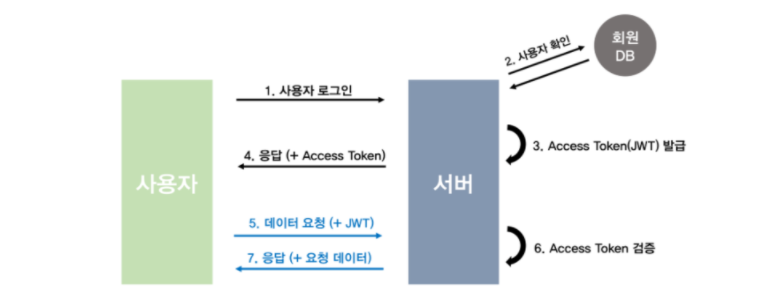

# WIL

항해 99에 들어와서 처음 해보는 프로젝트였다. 많은 것을 배웠고 또 자바스크립트에서 나는 여러 오류들을 핸들링 하면서 실력도 많이 늘어난 것 같다.

## jwt란?

jwt는 유저를 인증하고 식별하기 위한 토큰 기반 인증이다. jwt토큰은 세션 방식과는 달리 클라이언트에 저장되기 때문에 서버의 부담을 덜 수 있다.

또한 jwt는 토큰 자체에 사용자의 정보나 서비스를 사용하기 위한 정보가 포함된다는 것이다. 

jwt의 장점은 무상태 환경에서 사용자 데이터를 주고받을 수 있게 된다는 것이다. 세션을 사용하게 될 경우는 쿠키등을 통해 식별하고 서버에 세션을 저장했지만 jwt방식은 클라이언트에 저장하고 HTTP헤더에 토큰을 첨부하는 것만으로 단순하게 데이터를 요청하고 응답을 받아올 수 있다.

jwt는 크게 헤더/페이로드/시그니쳐의 세 부분으로 나누어져 있다.

### header

헤더에는 어떠한 알고리즘으로 암호화 할 것인지, 어떤 토큰을 사용할 것 인지에 대한 정보가 들어있다.

### payload

페이로드에는 전달하려는 정보가 들어있다. 페이로드에 들어있는 내용은 수정이 가능하여 더 많은 정보를 추가할 수 있다. 그러나 페이로드는 노출이 가능하기 때문에 인증이 필요한 최소한의 정보만을 담아야한다.

### signature

헤더와 페이로드를 합친 후 발급해준 서버가 지정한 비밀 키로 암호화시켜 토큰을 변조하기 어렵게 만들어준다.

예를 들어보면, 누군가 토큰을 탈취해 페이로드의 정보를 수정하면 페이로드에는 다른 누군가에 의해 조작된 정보가 들어있지만, 시그니처에는 수정되기 전의 페이로드 내용을 기반으로 이미 암호화 되어있는 결과가 저장되어 있기 때문에 조작되어있는 페이로드와는 다른 값이 나오게 된다.

이러한 방식으로 비교하면 서버는 토큰이 조작되었는지 아닌지를 쉽게 알 수 있고 다른 누군가는 조작된 토큰을 악용하기가 어려워진다.

## jwt의 동작원리

- 사용자가 id와 password를 입력하여 로그인 요청을 한다.

- 서버는 회원DB에 들어가 있는 사용자인지 확인을 한다.

- 확인이 되면 서버는 로그인 요청 확인 후, secret key를 통해 토큰을 발급한다.

- 이것을 클라이언트에 전달한다.

- 서비스 요청과 권한을 확인하기 위해서 헤더에 데이터(JWT) 요청을 한다.

- 데이터를 확인하고 JWT에서 사용자 정보를 확인한다.

- 클라이언트 요청에 대한 응답과 요청한 데이터를 전달해준다.

## jwt의 장점

- 토큰에 정보가 포함되기 때문에 별도의 인증 저장소가 필요 없다.

- 쿠키를 전달하지 않으므로 쿠키를 사용함으로써 발생하는 취약점이 사라진다.

- URL 파라미터와 헤더로 사용

- 독립적이고 확장성이 좋다

## jwt의 단점

- 토큰 자체에 정보를 담고 있으므로 위험할 수도 있다.

- 정보가 많아질수록 토큰의 길이가 늘어나 네트워크에 부하를 줄 수 있다.

- 중간에 payload가 탈취된다면 데이터를 볼 수 있으므로 페이로드에는 중요 데이터를 넣어서는 안된다

- jwt에는 상태가 없으므로 한번 만들어지면 제어가 불가능하다. 따라서 만료 시간을 꼭 넣어주어야 한다.

- 클라이언트측에서 토큰을 관리하기 때문에 클라이언트 측에서 토큰을 저장해야 한다.

## API란?

위키백과에 정의된 API는 다음과 같다.

API(Application Programing Interface)

> API는 응용 프로그램에서 사용할 수 있도록, 운영 체제나 프로그래밍 언어가 제공하는 기능을 제어할 수 있게 만든 인터페이스를 뜻한다.

인터페이스(Interface)

> 인터페이스(interface)는 컴퓨터 시스템끼리 정보를 교한하는 공유 경계를 의미한다, 터치 스크린과 같은 일부 컴퓨터 하드웨어 장치들은 인터페이스를 통해 데이터를 송수신 할 수 있으며, 마우스나 마이크론 폰가 같은 장치들은 오직 시스템에 데이터를 전송만 하는 인터페이스를 제공한다.

즉, 응용 프로그램에서 데이터를 주고받기 위한 방법을 의미한다. 어떤 방식으로 데이터를 요청해야 하는지, 그리고 어떤 데이터를 제공 받을 수 있을지에 대한 규격들을 API라고 한다.

이번에 했던 프로젝트에서는 클라이언트와 서버 사이의 데이터 규격들을 의미한다. 클라이언트에서는 서버에 어떤 데이터를 어떤 방식으로 줄 것이고 이러한 요청을 서버에서 받으면 어떤 데이터를 넘겨 줄 것인지에 대해 미리 정해놓은 것이다.
