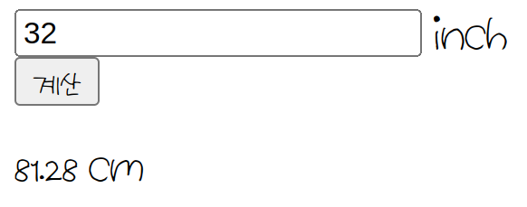
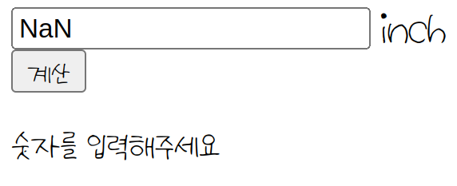
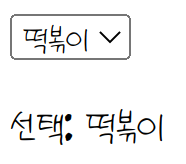
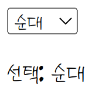
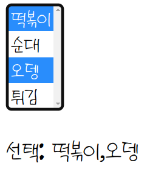
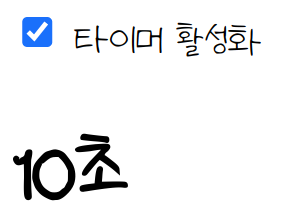

# 혼자 공부하는 자바스크립트 7-2: 이벤트 활용

## 이벤트 모델

이벤트를 연결하는 방법을 이벤트 모델이라고 부르는데, 표준 이벤트 모델, 고전 이벤트 모델, 인라인 이벤트 모델 세 가지가 있다.

- 표준 이벤트 모델: addEventListenr()를 이용한 이벤트 모델, 현재 표준으로 사용중이여서 표준 이벤트 모델이다. 여러개의 이벤트 연결이 가능하다.
- 고전 이벤트 모델: 과거에 사용했던 방법. 문서 객체가 가지고 있는 onXXXX 속성에 함수를 할당해서 이벤트를 연결한다. 한 개의 이벤트만 연결 가능해서 최근엔 쓰이지 않는다.
- 인라인 이벤트 모델: onxxxx요소를 HTML에 직접 집어넣어 이벤트를 연결한다. 2000년대 이후 쓰이지 않았으나 현재는 많은 라이브러리와 프레임워크가 인라인 이벤트 모델을 활용한다.

<b>표준 이벤트 모델</b>

```javascript
document.body.addEventListener('keyup',(){
	// do something
})
```

<b>고전 이벤트 모델</b>

```javascript
document.body.onkeyup=(event)=>{
	// do something
}
```
<b>인라인 이벤트 모델</b>

```HTML
<script>
const listener = (event) => {
	// do something
}
</script>
<body onkeyup="listener(event)">

</body>
```

모든 이벤트 모델의 이벤트 리스너는 첫 번째 매개변수로 이벤트 객체를 받는다. 이벤트 객체에는 이벤트와 관련된 정보가 들어있다.

## 키보드 이벤트

<table>
　　<tr>
　　　　<th>이벤트</th>
　　　　<th>설명</th>
　　</tr>
　　<tr>
　　　　<td>keydown</td>
　　　　<td>키가 눌릴 때 실행된다. 꾹 누르고 있을 때, 그리고 입력될 때 실행</td>
　　</tr>
　　<tr>
　　　　<td>keypress</td>
　　　　<td>키가 입력되었을 때 실행된다. 그러나 웹 브라우저에 따라 아시아권의 문자가 제대로 처리되지 않는 문제가 있다.</td>
　　</tr>
　　<tr>
　　　　<td>keyup</td>
　　　　<td>키보드에서 키가 떨어질 때 실행된다. 가장 일반적으로 사용됨</td>
　　</tr>
</table>

<b>남은 글자 수 출력하기</b>

```HTML
<!DOCTYPE html>
<html lang="en">

<head>
    <meta charset="UTF-8">
    <meta http-equiv="X-UA-Compatible" content="IE=edge">
    <meta name="viewport" content="width=device-width, initial-scale=1.0">
    <title>Document</title>
</head>
<script>
    document.addEventListener('DOMContentLoaded', () => {
        const textarea = document.querySelector('textarea')
        const h1 = document.querySelector('h1')

        textarea.addEventListener('keyup', (event) => {
            const length = textarea.value.length
            h1.textContent = `글자 수: ${length}`
        })
    })
</script>
<body>
    <h1></h1>
    <textarea></textarea>
</body>
</html>
```

실행 결과


만약, keydown이벤트로 구현하면 상황에 따라 글자 수를 제대로 세지 못할 수 도 있다.


그러나, 사실 keyup 이벤트에도 문제가 있다. 키가 키보드에서 떨어질 때 발생하므로 특정 키를 꾹 누르고 있으면 글자 수를 세지 못한다.

트위터에서는 초기에 keypress 이벤트로 글자 수를 세어 140자 제한을 두었는데, 아시아권 문자의 글자 수를 제대로 인식하지 못하는 문제가 발생해 현재는 키보드 이벤트를 사용하지 않고 글자 수를 세고 있다고 한다.

### 키보드 키 코드 사용하기

키보드 이벤트가 발생할 때, 이벤트 객체로 어떤 키를 눌렀는지와 관련된 속성들이 따라온다. 여러 속성들이 있지만 책에서는 다음과 같은 속성들만 알아보았다.

<table>
　　<tr>
　　　　<th>이벤트 속성 이름</th>
　　　　<th>설명</th>
　　</tr>
　　<tr>
　　　　<td>code</td>
　　　　<td>입력한 키</td>
　　</tr>
　　<tr>
　　　　<td>keyCode</td>
　　　　<td>입력한 키를 나타내는 숫자</td>
　　</tr>
　　<tr>
　　　　<td>altKey</td>
　　　　<td>Alt키를 눌렀는지</td>
　　</tr>
　　<tr>
　　　　<td>ctrlKey</td>
　　　　<td>Ctrl키를 눌렀는지</td>
　　</tr>
　　<tr>
　　　　<td>shiftKey</td>
　　　　<td>Shift키를 눌렀는지</td>
　　</tr>
</table>

code속성엔 입력한 키를 나타내는 문자열이, altKey, ctrlKey, shiftKey는 해당 키가 눌렸는지에 대한 논리값이 들어있다.

keyCode의 값은 ASCII코드를 기반으로 만들어졌으며, 자세한 코드 값은 [여기](https://wenna.tistory.com/15)서 확인 가능하다.

<b>keydown과 keyup 이벤트가 발생할 때 각 속성을 출력하는 프로그램</b>

```HTML
<!DOCTYPE html>
<html>

<head>
    <title></title>
    <script>
        document.addEventListener('DOMContentLoaded', () => {
            const h1 = document.querySelector('h1')
            const print = (event) => {
                let output = ''
                output += `alt: ${event.altKey}<br>` // alt키가 눌리면 true, 아니면 false
                output += `ctrl: ${event.ctrlKey}<br>` // ctrl키가 눌리면 true, 아니면 false
                output += `shift: ${event.shiftKey}<br>` // shift키가 눌리면 true, 아니면 false
                output += `code: ${typeof (event.code) !== 'undefined' ?
                    event.code : event.keyCode}<br>` // event.code가 있으면 출력, 없으면 event.keyCode를 출력
                h1.innerHTML = output
            }

            document.addEventListener('keydown', print)
            document.addEventListener('keyup', print)
        })
    </script>
</head>

<body>
    <h1></h1>
</body>

</html>
```

초기값, 새로고침을 실행해서 code의 값이 F5이다.


각 키를 눌렀을 때 결과를 올리고 싶은데.. 컨트롤,알트,쉬프트를 누른 채 스크린샷이 안찍힌다...

## 이벤트 발생 객체

지금까지는 이벤트 내부에서 문서 객체 변수를 사용해 문서 객체와 관련된 정보를 추출했다.

```javascript
document.addEventListener('DOMContentLoaded', () => {
	const textarea = document.querySelector('textarea') // 문서 객체를 textarea 변수에 할당
	const h1 = document.querySelector('h1')

textarea.addEventListener('keyup', (event) => {
		const length = textarea.value.length // textarea의 value에 접근
		h1.textContent = `글자 수: ${length}`
	})
})
```

그런데 상황에 따라서는 이벤트 리스너 내부에서 그러한 변수에 접근할 수 없는 경우가 생긴다. 

```javascript
// 이벤트 리스너를 외부로 빼낸 경우
const listener= (event)=>{
	const length = textarea.value.length // 현재 블록에서는 textarea 변수를 사용할 수 없음!
	h1.textContent = `글자 수: ${length}`
}
document.addEventListener('DOMContentLoaded', () => {
	const textarea = document.querySelector('textarea')
	const h1 = document.querySelector('h1')

	textarea.addEventListener('keyup', listener) // 리스너 함수를 외부로 분리
})
```

위와 같은 경우에서 이벤트를 발생시킨 객체에 접근하기 위해서는 2가지 방법으로 문제를 해결할 수 있다.

1. event.currentTarget 속성을 사용한다.

화살표 함수와 function()형태 모두에서 사용 가능하다.

2. this 키워드를 이용한다.

이는 function()형태에서만 사용 가능하다.

현재는 두 가지 방법 모두 사용되나, 라이브러리와 프레임워크에 따라 선호하는 형태가 다르다. 공식문서를 찾아보면서 어떤 형태가 더 일반적으로 사용되는지 확인하고 사용하자.

<b>event.currentTarget을 이용하는 경우</b>

```javascript
const listener= (event)=>{
	const length = event.currentTarget.value.length // event.currentTarget이 textarea가 된다.
	h1.textContent = `글자 수: ${length}`
}
document.addEventListener('DOMContentLoaded', () => {
	const textarea = document.querySelector('textarea')
	const h1 = document.querySelector('h1')

	textarea.addEventListener('keyup', listener)
})
```

<b>this 키워드를 이용하는 경우</b>

```javascript
const listener= (event)=>{
	const length = this.value.length // this가 textarea가 된다.
	h1.textContent = `글자 수: ${length}`
}
document.addEventListener('DOMContentLoaded', () => {
	const textarea = document.querySelector('textarea')
	const h1 = document.querySelector('h1')

	textarea.addEventListener('keyup', listener)
})
```

아마 textarea객체에서 리스너를 호출하므로 this가 textarea가 되는것이지 않을까 싶다.

## 글자 입력 양식 이벤트

사용자로부터 어떠한 입력을 받을 때 사용하는 요소를 <strong>입력 양식</strong><sup>form</sup>이라고 한다. HTML에서는 input, textarea, button, select... 등이 있다.

### input 태그

입력 양식을 사용하는 간단한 예제를 inch를 cm단위로 변경하는 간단한 컨버터 프로그램으로 알아보자.

```HTML
<!DOCTYPE html>
<html>
  <head>
    <title></title>
    <script>
      document.addEventListener('DOMContentLoaded', () => {
        const input = document.querySelector('input')
        const button = document.querySelector('button')
        const p = document.querySelector('p')

        button.addEventListener('click', () => {

          // 입력을 숫자로 변환한다.
          const inch = Number(input.value)

          // 숫자가 아니라면 바로 리턴.
          if (isNaN(inch)) {
            p.textContent = '숫자를 입력해주세요'
            return
          }

          // 변환해서 출력한다.
          const cm = inch * 2.54
          p.textContent = `${cm} cm`
        })
      })
    </script>
  </head>
  <body>
    <input type="text"> inch<br> // input태그를 사용했다.
    <button>계산</button>
    <p></p>
  </body>
</html>
```



숫자를 입력하지 않은 경우



### select 태그

select 태그를 이용하면 드롭다운 목록을 구현할 수 있다. 다음 코드는 select태그를 사용해서 드롭다운 목록을 만들고, 목록을 선택했을 때(값이 변경되었을 때) 어떤 것을 선택했는지 출력하는 예제이다.

```HTML
<!DOCTYPE html>
<html>
  <head>
    <title></title>
    <script>
      document.addEventListener('DOMContentLoaded', () => {
        const select = document.querySelector('select') // select 문서 객체를 select변수에 할당하고
        const p = document.querySelector('p')

        select.addEventListener('change', (event) => { // select가 바뀌었을 때 이벤트 리스너를 달아주고
          const options = event.currentTarget.options
          const index = event.currentTarget.options.selectedIndex

          p.textContent = `선택: ${options[index].textContent}` // 값을 출력해준다.
        })
      })
    </script>
  </head>
  <body>
    <select> // select 태그를 사용했다.
      <option>떡볶이</option>
      <option>순대</option>
      <option>오뎅</option>
      <option>튀김</option>
    </select>
    <p>선택: 떡볶이</p>
  </body>
</html>
```





select에 multiple속성을 부여하면 ctrl키 또는 shift키를 누르고 여러 항목을 선택할 수 있다.

<b>multiple select 태그</b>

```HTML
<!DOCTYPE html>
<html>
  <head>
    <title></title>
    <script>
      document.addEventListener('DOMContentLoaded', () => {
        const select = document.querySelector('select')
        const p = document.querySelector('p')

        select.addEventListener('change', (event) => {
          const options = event.currentTarget.options
          const list = []
          for (const option of options) { // option속성에는 forEach()메소드가 없어서 반복문을 돌려야 한다.
            if (option.selected) {
              list.push(option.textContent) // 만일 선택되었으면 list에 푸쉬하고
            }
          }
          p.textContent = `선택: ${list.join(',')}` // list의 값을 ","로 이어붙여 출력한다
        })
      })
    </script>
  </head>
  <body>
    <select multiple> // multiple 속성 부여
      <option>떡볶이</option>
      <option>순대</option>
      <option>오뎅</option>
      <option>튀김</option>
    </select>
    <p></p>
  </body>
</html>
```



### checkbox

체크박스는 클릭하면 선택되고, 다시 클릭하면 선택이 해제되는 사각형 모양의 박스이고, 체크박스는 input 태그로 만든다.

체크 박스의 체크 상태를 확인하기 위해서는 입력 양식의 checked속성을 사용해야 한다.

체크 상태일때만 타이머를 증가시키는 간단한 예제를 살펴보자. 

```HTML
<!DOCTYPE html>
<html>
  <head>
    <title></title>
    <script>
      document.addEventListener('DOMContentLoaded', () => {
        let [timer, timerId] = [0, 0]
        const h1 = document.querySelector('h1')
        const checkbox = document.querySelector('input')

        checkbox.addEventListener('change', (event) => {
          if (event.currentTarget.checked) {
          
            // 체크 상태이면 setInterval함수를 호출하고
            timerId = setInterval(() => {
              timer += 1
              h1.textContent = `${timer}초`
            }, 1000)
          } else {
          
            // 체크 해제 상태이면 clearInterval함수를 호출한다.
            clearInterval(timerId)
          }
        })
      })
    </script>
  </head>
  <body>
    <input type="checkbox">
    <span>타이머 활성화</span>
    <h1></h1>   
  </body>
</html>
```



체크하면 타이머가 증가되고, 체크를 해제하면 타이머가 중지된다.

setInterval함수는 어떤 코드를 일정한 시간 간격을 두고 반복해서 실행하고 싶을 때 사용하는 함수이다. 첫 번째 인자로 실행할 함수를 받고 두 번째 인자로 밀리초 단위의 반복 주기를 받는다. setInterval 함수에 대한 자세한 설명은 [여기](https://developer.mozilla.org/en-US/docs/Web/API/setInterval)에서 볼 수 있다.

clearInterval함수는 setInterval함수의 반복을 중단하는 함수이다. 자세한 설명은 [여기](https://developer.mozilla.org/en-US/docs/Web/API/clearInterval)에서 볼 수 있다.
