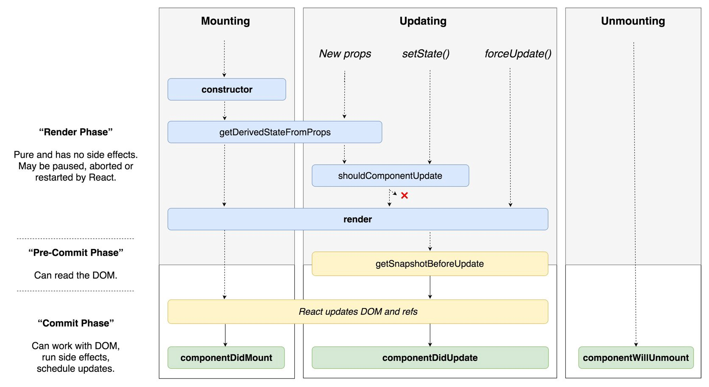

# WIL

- [state](#state)
- [props](#props)
- [리액트 리렌더링](#리액트-리렌더링)

## state

`state`는 `props`처럼 `App`컴포넌트의 렌더링 결과물에 영향을 주는 데이터를 갖고 있는 객체지만,

`props`는 (함수 매개변수처럼) 컴포넌트에 전달되는 반면 `state`는 (함수 내에 선언된 변수처럼) <b>컴포넌트 안에서 관리</b>s된다는 차이가 있다.

props를 사용했는데도 state를 사용하는 이유는, <b>사용하는 쪽과 구현하는 쪽을 철저하게 분리</b>시켜서 양쪽의 편의성을 각자 도모하는 것에 있다.

`state` 객체를 사용하고 싶다면 컴포넌트를 생성할 때 가장 윗부분에 선언해준다. 함수형 컴포넌트에선 `useState()`라는 훅을 이용해 `state`객체를 선언할 수 있다.

```javascript
import {useState} from 'react'

function App(){
	const [myState, setMyState]=useState();
}
```

`useState`안에 인자로 전달 된 값이 해당 `state`의 초기값이 된다.

리액트는 얕은 참조를 통해 상태를 비교한다. 따라서 `myState = "myState"`와 같은 식으로 state의 값을 변경하면 <b>리액트가 상태의 변화를 알아채지 못하고 렌더링을 하지 않는다.</b>

따라서 항상 딸려오는 `setter`함수를 이용하여 `state`를 바꿔주어야한다.

## props

`props`는 `properties`의 줄임말로 상위 컴포넌트에서 전달받은 속성을 의미한다. 프로퍼티는 <b>수정할 수 없다.</b> 즉 자식 컴포넌트 입장에서는 읽기 전용인 데이터이다.

프로퍼티에 문자열을 전달할 때는 큰따옴표(" ")를, 문자열 외의 값을 전달할 때는 중괄호를({})사용한다.

```javascript
function InputForm({ }) {

	const text = useSelector((state) => state.text)
	const title = text.title;
	const contents = text.contents;

	return (
		<StyledForm>
			<InputText name="제목" text={title} changeText={changeTitle} />
			<InputText name="내용" text={contents} changeText={changeContents} />
			<Btn disabled={disable} type="button" submit={onSubmitHandler} />
		</StyledForm>
	)
}
```

`InputForm` 컴포넌트에서 `InputText`라는 자식 컴포넌트로 `props`를 넘겨주는 간단한 예제이다. (import같이 불필요한 코드는 삭제했다.)

상위 컴포넌트에서 하위 컴포넌트에게 위와 같은 방법으로 `props`를 전달할 수 있다.

## 리액트 리렌더링과 생명주기

컴포넌트는 `생성(mounting)`, `업데이트(updating)`, `제거(unmounting)`의 생명주기를 갖는다. 리액트 클래스 컴포넌트는 <b>라이프사이클 메서드를 사용</b>하고, 함수형 컴포넌트는 <b>Hook을 사용해 특정 라이프 사이클 지점에서 코드를 호출</b>할 수 있다.

리액트에서 업데이트가 발생하는 경우는 다음의 네 가지이다.

1. props가 바뀔 때
2. state가 바뀔 때
3. 부모 컴포넌트가 리렌더링 할 때
4. this.forceUpdate로 강제 렌더링을 트리거 할 때



render()메소드는 반드시 호출되어야하고, 다른 메소드들은 선택적으로 호출 될 수 있다.

<b>1. constructor</b>

`constructor()` 메소드는 컴포넌트가 초기화될 때 다른 어떤 메소드보다 먼저 호출되며, state 와 다른 초기 값들을 세팅한다.

`constructor()` 메소드는 props 라고도 불리며, `super(props)` 를 가장 먼저 호출해야 한다. `super(props)` 는 부모의 constructor 메소드를 초기화하고, 부모로 부터 상속받은 메소드들을 컴포넌트로 하여금 사용할 수 있도록 해준다.

```javascript
class Header extends React.Component {
  constructor(props) {
    super(props)
    this.state = { favoritecolor: 'red' }
  }
  render() {
    return <h1>My Favorite Color is {this.state.favoritecolor}</h1>
  }
}

ReactDOM.render(<Header />, document.getElementById('root'))
```
- Header 컴포넌트는 `constructor()` 를 통해 React.Component를 상속 받아 상속 받은 props와 state값을 저장한다.
- state 객체의 초기값은 favoritecolor 속성을 "red"로 지정한다.

<b>2. getDerivedStateFromProps</b>

`getDerivedStateFromProps()` 메소드는 DOM에서 요소들이 렌더링 되기 직전에 호출된다.

최초의 props로 받아 온 값을 state에 동기화 시키는 용도로 사용된다.

```javascript
class Header extends React.Component {
  constructor(props) {
    super(props)
    this.state = { favoritecolor: 'red' }
  }
  static getDerivedStateFromProps(props, state) {
    return { favoritecolor: props.favcol }
  }
  render() {
    return <h1>My Favorite Color is {this.state.favoritecolor}</h1>
  }
}

ReactDOM.render(<Header favcol="yellow" />, document.getElementById('root'))

```

- `getDerivedStateFromProps()` 는 props와 state를 인자로 받아 props의 favcol 값을 state의 favoritecolor 속성 값으로 세팅한다.

<b>3. render</b>

`render()` 메소드는 필수값이며, DOM에 HTML을 표현해준다.

```javascript
class Header extends React.Component {
  render() {
    return <h1>This is the content of the Header component</h1>
  }
}

ReactDOM.render(<Header />, document.getElementById('root'))
```

- `render()` 함수로 반환되는 html을 root DOM에 표현한다.

<b>4. componentDidMount</b>

`componentDidMount()` 메소드는 컴포넌트가 렌더링된 직 후에 호출된다.

이미 DOM에 위치한 컴포넌트를 필요로 하는 구문을 사용하는 곳이다.

```javascript
class Header extends React.Component {
  constructor(props) {
    super(props)
    this.state = { favoritecolor: 'red' }
  }
  componentDidMount() {
    setTimeout(() => {
      this.setState({ favoritecolor: 'yellow' })
    }, 1000)
  }
  render() {
    return <h1>My Favorite Color is {this.state.favoritecolor}</h1>
  }
}

ReactDOM.render(<Header />, document.getElementById('root'))
```

- `componentDidMount()` 를 통해 Header 컴포넌트가 렌더링 된 직후 1초 후에 state 값을 변경한다. (red에서 yellow로)

### Updating

그 다음 단계인 Updating은 컴포넌트가 업데이트 할 때를 의미한다. 컴포넌트는 state나 props가 변경될 때 마다 업데이트 된다

5가지 내장 메소드가 있고, 컴포넌트가 업데이트 되면 순서대로 실행된다.

1. `getDerivedStateFromProps()`
2. `shouldComponentUpdate()`
3. `render()`
4. `getSnapshotBeforeUpdate()`
5. `componentDidUpdate()`

<b>1. getDerivedStateFromProps()</b>

update 단계에서 가장 먼저 `getDerivedStateFromProps` 메소드가 호출된다. props로 받아 온 값을 state에 동기화 시키는 용도로 사용된다.

```javascript
class Header extends React.Component {
  constructor(props) {
    super(props)
    this.state = { favoritecolor: 'red' }
  }
  static getDerivedStateFromProps(props, state) {
    return { favoritecolor: props.favcol }
  }
  changeColor = () => {
    this.setState({ favoritecolor: 'blue' })
  }
  render() {
    return (
      <div>
        <h1>My Favorite Color is {this.state.favoritecolor}</h1>
        <button type="button" onClick={this.changeColor}>
          Change color
        </button>
      </div>
    )
  }
}

ReactDOM.render(<Header favcol="yellow" />, document.getElementById('root'))
```

- 위 컴포넌트에서 버튼을 클릭하면 onClick 이벤트로 favoritecolor를 ‘blue’로 변경해주지만, update 직후 실행되는 `getDerivedStateFromProps` 메소드로 인해 props.favcol로 전달받은 ‘yellow’가 여전히 state 값으로 남아있게 된다.

<b>2. shouldComponentUpdate</b>

`shouldComponentUpdate()` 메소드는 React가 렌더링을 계속해야하는지 마는지에 대한 Boolean 값을 반환한다. 기본 값은 `true`이다.

```javascript
class Header extends React.Component {
  constructor(props) {
    super(props)
    this.state = { favoritecolor: 'red' }
  }
  shouldComponentUpdate() {
    return false
  }
  changeColor = () => {
    this.setState({ favoritecolor: 'blue' })
  }
  render() {
    return (
      <div>
        <h1>My Favorite Color is {this.state.favoritecolor}</h1>
        <button type="button" onClick={this.changeColor}>
          Change color
        </button>
      </div>
    )
  }
}

ReactDOM.render(<Header />, document.getElementById('root'))
```

- 위 컴포넌트에서 `shouldComponentUpdate()` 값이 false로 되어 있으므로 컴포넌트는 업데이트 되지 않는다.

<b>3. render</b>

컴포넌트가 업데이트 되면 역시 `render()` 도 호출된다. 새로운 변경점들을 갖고 리렌더링 된다.

<b>4. getSnapshotBeforeUpdate, 5. componentDidUpdate</b>

`getSnapshotBeforeUpdate()` 메소드는 업데이트 되기 전의 props와 state에 접근할 수 있다. 즉, update 이후에도 update 이전의 값들을 확인할 수 있다는 것을 의미한다.

만약 `getSnapshotBeforeUpdate()` 메소드가 존재하면, `componentDidUpdate()` 메소드도 포함해야 한다. 그렇지 않으면 에러가 발생한다.

`componentDidUpdate()` 메소드는 컴포넌트가 DOM에서 update된 후에 호출된다.

```javascript
class Header extends React.Component {
  constructor(props) {
    super(props)
    this.state = { favoritecolor: 'red' }
  }
  componentDidMount() {
    setTimeout(() => {
      this.setState({ favoritecolor: 'yellow' })
    }, 1000)
  }
  getSnapshotBeforeUpdate(prevProps, prevState) {
    document.getElementById('div1').innerHTML =
      'Before the update, the favorite was ' + prevState.favoritecolor
  }
  componentDidUpdate() {
    document.getElementById('div2').innerHTML =
      'The updated favorite is ' + this.state.favoritecolor
  }
  render() {
    return (
      <div>
        <h1>My Favorite Color is {this.state.favoritecolor}</h1>
        <div id="div1"></div>
        <div id="div2"></div>
      </div>
    )
  }
}

ReactDOM.render(<Header />, document.getElementById('root'))
```

- 초기값이 ‘red로 렌더링 되면, `componentDidMount()` 메소드에 의해 1초 후 값이 ‘yellow’로 업데이트 되고, 그 다음에 `getSnapshotBeforeUpdate()` 메소드가 실행되며 div1에 해당 텍스트가 출력된다.
- 업데이트 이전 내역을 표시해 주었으므로 업데이트 이후도 실행되야 하기 때문에 `componentDidUpdate()` 가 포함되어야 한다.

### Unmounting

Mount의 반대과정, 즉 컴포넌트를 DOM에서 제거하는 것을 `Unmount` 라고 한다.

언마운트시 호출되는 메소드는 `componentWillUnmount` 하나이다.

<b>1. componentWillUnmount</b>

컴포넌트가 언마운트되기 전에 호출되는 메소드이다. 이벤트 리스너를 제거할 때와 같이 정리가 필요할 때 사용한다.


