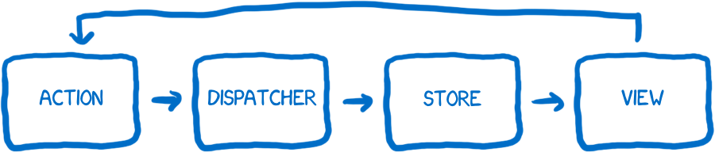
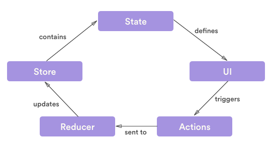
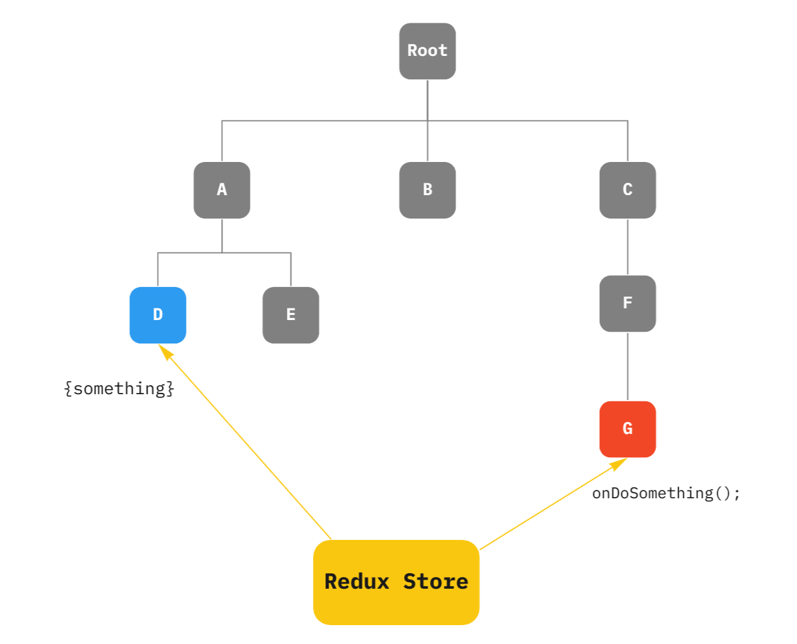

# styled-components, redux

- [styled-components](#styled-components)
	- [패키지 설치](#패키지-설치)
	- [기본 문법](#기본-문법)
- [redux](#redux)
	- [redux 기본 개념](#redux-기본-개념)
	- [redux의 3가지 원칙](#redux의-3가지-원칙)
- [redux 실전 예제](#redux-실전-예제)
	- [리듀서, 액션, 액션 생성 함수](#리듀서-액션-액션-생성-함수)
	- [store 생성하기](#store-생성하기)
	- [dispatch, 액션 일으키기](#dispatch-액션-일으키기)
	- [useSelector](#useSelector)
	
## styled-components

원래의 웹 개발 패러다임은 html, js, css를 모두 분리하여 코딩하는 것이었다. 하지만 여러 모던 자바스크립트 라이브러리가 인기를 끌고, 재활용이 가능한 컴포넌트 기반 개발 방법이 주류가 되면서 css,js,html을 한 파일에 때려박는 방식이 유행을 하고있다.

리액트는 jsx문법을 이용하여 js가 html을 포함하는 형태로 둘을 한 파일로 합쳤고, css역시 js파일에 담기 위해 CSS in JS라는 개념이 등장했다.

### 패키지 설치

```
yarn add styled-components
```

설치 후 `package.json`에 `styled-components`가 추가된 것을 볼 수 있다.

```
"dependencies": {
    "@testing-library/jest-dom": "^5.16.5",
    "@testing-library/react": "^13.4.0",
    "@testing-library/user-event": "^13.5.0",
    "bootstrap": "^5.2.3",
    "react": "^18.2.0",
    "react-bootstrap": "^2.6.0",
    "react-dom": "^18.2.0",
    "react-router-dom": "^6.4.4",
    "react-scripts": "5.0.1",
    "styled-component": "^2.8.0",
    "styled-components": "^5.3.6",
    "web-vitals": "^2.1.4"
  },
```

### 기본 문법

```javascript
import styled from "styled-components"

const StyledButton = styled.button`
	// CSS 문법 작성
`
```
HTML 엘리먼트를 스타일링 할 때는 모든 알려진 HTML 태그에 대해서 이미 정의되어 있기 때문에 해당 태그명의 속성에 접근하면 된다.

```javascript
import Button from 'react-bootstrap/Button';
import styled from "styled-components"

const StyledButton = styled(Button)`
	// CSS 문법 작성
`
```
만약 이미 만들어진 컴포넌트나 부트스트랩등을 스타일링 하고 싶으면 해당 컴포넌트를 import하고 인자로 넘겨주면 된다.

## redux

redux는 react의 상태 관리 라이브러리이다. 리덕스를 사용하면 컴포넌트의 상태 업데이트 관련 로직을 다른 파일로 분리시켜서 효율적으로 관리할 수 있다.

redux를 사용하지 않으면 말단 컴포넌트의 상태 변화가 최상위 컴포넌트까지 올라가서 전체 페이지를 리렌더링 시키는 경우가 발생한다. 이는 불필요한 리렌더링을 불러오므로 비효율적이다.

필요한 컴포넌트까지 props를 계속 내려주는 리액트의 방식은 중간 컴포넌트에서 사용되지 않고, 오로지 하위컴포넌트로 전달하기위해 존재하는 props들이 생겨나면서 데이터 흐름을 비효율적으로 만든다. 또한 상위 컴포넌트에서 props 이름을 변경할 경우 해당 props가 거쳐간 모든 컴포넌트에서 이름을 수정해주어야 하기 때문에 코드 관리 측면에서도 좋지 않다.

redux는 이를 옵저버 패턴 (발행/구독 패턴이라고도 한다)과 flux패턴을 사용함으로써 해결했다.

> <b>flux 구조</b>
> 
> 
> 
> Flux 패턴은 `action`이 발생하면 `dispatcher`에 의해 `store`에 변경된 사항이 저장되고, 그 저장된 사항에 의해 `view`가 변경되는 단방향 패턴을 보이고 있다.
> 여기서 `dispatcher`란 어플리케이션에서 발생한 `action`들을 정리해주는 역할을 하며 `store`란 어플리케이션의 데이터들이 저장되는 장소이다.
> 
> <b>redux의 구조</b>
> 
> 
> 
> <b>redux를 사용하면...</b>
> 
> 
> 
> - 리덕스를 사용하면 하나의 `store`를 통해 모든 `state`와 `상태 관리 로직`을 저장, 유지할 수 있게 되며 원하는 Component로만 data를 전달할 수 있다.
> - 리덕스를 사용하면 컴포넌트들의 상태 관련 로직들을 다른 파일들로 분리시켜서 더욱 효율적으로 관리 할 수 있고, 컴포넌트끼리 상태를 공유하게 될 때 여러 컴포넌트를 거치지 않고도 손쉽게 상태 값을 전달할 수 있다.
> - 리덕스는 한 방향으로만 동작하기 때문에 데이터의 흐름을 예측하기 쉽다.
> - 리덕스의 미들웨어라는 기능을 통하면 비동기 작업, 로깅 등의 확장적인 작업들을 더욱 쉽게 할 수도 있다.
> - 리덕스는 시간여행형 디버거와 결합된 실시간 코드 수정과 같은 훌륭한 개발자 경험도 제공한다.

리덕스를 사용하기 위해서는 해당 프로젝트 디렉토리로 들어가서

```
yarn add redux
```

를 입력해주면 리덕스가 설치된다.

### redux 기본 개념

<b>액션 (action)</b>

상태에 변화가 필요하다면 액션을 발생시켜야 한다. 액션은 하나의 객체로 표현된다.

```javascript
{
	type: 'ADD_TODO',
	data: {
		id: 1,
		text: '리덕스 배우기'
	}
}
```

- type은 필수이다. 일종의 액션 이름 역할을 하며 주로 대문자로 작성되고 고유해야한다.
- type 외의 값은 상태 업데이트시, 혹은 추후에 참고할 값이다.
***
<b>액션 생성 함수(action creator)</b>

액션 객체를 만들어주는 함수이다, 화살표 함수와 일반 함수의 형태로 만들 수 있다.

```javascript
// 화살표 함수
const addTodo= (data) => ({
	type: 'ADD_TODO',
	data
})

// 일반 함수
function addTodo(data) {
	return {
		type: 'ADD_TODO',
		DATA
	}
}
```

- 상태의 변화가 생길 때 마다 액션 객체를 만들어 주어야 한다. 그러나 매번 객체를 직접 작성하기는 번거롭고, 데이터를 놓치는 등의 실수를 발생시킬 수 있다. 이러한 상황을 방지하기 위해 액션 생성 함수를 사용한다.
***
<b>리듀서</b>

변화를 일으키는 함수이다. 현재 상태와 액션 객체를 받아 필요하다면 새로운 상태를 리턴하는 함수이다.

```javascript
const initialState = {
	counter: 1
}

// state가 undefined일 때는 initialState를 기본값으로 사용
function reducer(state = initialState, action) {
	switch (action.type) {
		case INCREMENT:
			return {
				...state, // 불변성 유지 (spread 연산자 사용 예시)
				counter: state.counter + 1
			};
		default: 
			return state;
	}
}
```

- 리듀서 첫 호출 시 state의 값은 undefined이다. 이 때 `initialState`를 기본 값으로 설정하기 위해 함수 파라미터에 기본값을 설정해준다.
- 리덕스의 상태는 spread 연산자로 불변성 관리와 업데이트가 가능하게 하기 위해 최대한 복잡하지 않은 구조로 진행하는 것이 좋다.
- 만약 구조가 복잡하거나 배열도 다룰 경우 `immer`라는 라이브러리를 사용하면 쉽게 리듀서 함수가 작성 가능하다고 한다.

<b>루트 리듀서</b>

- `createStore`함수를 사용하여 스토어를 만들 때는 리듀서를 1개만 사용해야 한다. 리듀서가 여러개 있는 경우 `combinedReducers`함수를 이용하여 리듀서를 한개로 합칠 수 있다.

```javascript
import { combineReducers } from 'redux';
import counter from './counter'; // 리듀서 1
import todos from './todos'; // 리듀서 2

const rootReducer = combineReducers({
	counter,
	todos,
});

export default rootReducer;
```
***
<b>디스패치</b>

스토어 내장 함수중 하나이다.

- 역할 
	- 액션을 발생시킨다
	- 액션을 스토어에 전달한다

- 사용 방식
	- 형태: `dispatch(action)`
	- 액션 객체를 파라미터로 넣어 호출한다.
	- 호출되면 스토어에서 리듀서 함수르 실행해 새로운 상태를 만든다.
***
<b>구독</b>

스토어 내장 함수중 하나이다.

```javascript
const listener = () => {
	console.log('상태가 업데이트됨');
}
const unsubscribe = store.subscribe(listener);

unsubscribe(); // 추후 구독을 비활성화할 때 함수를 호출
```

- `subscribe` 함수 내부에 리스너를 파라미터로 넣어 호출하면 상태가 업데이트 될 때마다 리스너가 호출된다.
***
### redux의 3가지 원칙

리덕스에는 반드시 지켜져야 하는 3가지 규칙이 있다.

<strong>1. 하나의 애플리케이션 안에는 하나의 스토어만 존재한다</strong>

리덕스는 하나의 App에는 하나의 스토어만 두어 여러개의 스토어를 구독해 발생할 수 있는 혼란을 피한다. 스토어가 하나만 존재하기 때문에 여러가지 `reducer`를 조합하여 하나의 `store`를 생성한다. `combineReducers` 메서드를 사용해 여러개의 `reducer`를 하나의 `store`로 구성할 수 있다.

<strong>2. 상태는 읽기전용이다.</strong>

리덕스도 리액트와 마찬가지로 기존의 상태는 건드리지 않고 새로운 상태 객체를 생성하여 상태를 업데이트 해준다. 이를 위해 `전개연산자(...)`나 `concat`, `Object.assign`등을 사용한다.

- 상태의 불변성을 유지하면 나중에 개발자 도구를 통해 뒤로 돌릴 수도 있고 다시 앞으로 돌릴 수도 있다.
- 리덕스에서 불변성을 유지해야 하는 이유는 내부적으로 데이터가 변경 되는 것을 감지하기 위하여 얕은 비교 검사를 하기 때문이다. 이를 통하여 객체의 변화를 감지할 때 객체의 깊숙한 안쪽까지 비교를 하는 것이 아니라 겉핥기 식으로 비교를 하여 좋은 성능을 유지할 수 있다.

<strong>3. 리듀서는 순수함수여야 한다</strong>

순수함수는 동일한 인풋이라면 언제나 동일한 아웃풋이 있어야 한다. 즉 똑같은 파라미터로 호출된 리듀서 함수는 언제나 똑같은 결과값을 반환해야한다.

리듀서 함수는 파라미터로 `state`와 `action` 객체를 받는다. 이때, 리듀서 함수는 인자로 받아온 `state`는 변경하지 않고, `action`을 통해 변경한 <b>새로운</b> state 객체를 만들어서 반환해야한다.

### 리덕스 상태 변화의 흐름


- 초기 상태
	- 먼저 root reducer 함수를 사용하여 만들어진 리덕스 스토어가 있다.
	- 스토어는 root reducer를 한번 호출하고 리턴 값을 초기 상태로 저장한다.
	- UI가 처음 렌더링될 때, UI 컴포넌트는 리덕스 스토어의 상태에 접근하여 그것을 렌더링에 활용한다. 또한 그것들은 후에 상태의 변화가 업데이트 되는 것을 구독한다.

- 업데이트
	1. 유저가 버튼을 클릭한다.
	2. 앱은 유저의 행동에 맞는 디스패치를 실행해 액션을 일으킨다.
	3. 스토어는 이전 상태와 현재 액션으로 리듀서 함수를 실행하고, 그 리턴 값을 새로운 상태로 저장한다.
	4. 스토어는 스토어를 구독하고 있던 UI들에게 업데이트 되었다고 알려준다.
	5. 스토어의 데이터가 필요한 각각의 UI들은 필요한 상태가 업데이트 되었는지 확인한다.
	6. 데이터가 변경된 각 구성요소는 새 데이터로 강제로 다시 렌더링하므로 화면에 표시되는 내용을 업데이트 할 수 있다.

## redux 실전 예제

### 리듀서, 액션, 액션 생성 함수

먼저, ducks 패턴을 사용하여 같은 기능을 하는 리듀서, 액션, 액션 생성 함수들을 같은 js파일에 모아놓는다. todolist 예제에서는 todo 삭제, 추가, 완료/미완료 상태 변경 등이 있을 것이다.

```javascript
const ADD_TODO = 'todoList/ADD_TODO'
const DELETE_TODO = 'todoList/DELETE_TODO'
const TOGGLE_STATUS_TODO = 'todoList/TOGGLE_STATUS_TODO'
const GET_TODO_BY_ID = 'todoList/GET_TODO_BY_ID'
```

가장 먼저 액션을 정의하였다. 액션의 이름은 대문자로 선언하는게 보통이고 `"리듀서 이름/액션 이름"`과 같이 액션 이름을 지어 서로 다른 리듀서에서 액션 이름이 중첩되는 경우를 방지한다. 

```javascript
export const addTodo = (payload) => {
    return {
        type: ADD_TODO,
        payload,
    }
}
export const deleteTodo = (payload) => {
    return {
        type: DELETE_TODO,
        payload,
    }
}
export const toggleStatusTodo = (payload) => {
    return {
        type: TOGGLE_STATUS_TODO,
        payload,
    }
}
export const getTodoById = (payload) => {
    return {
        type: GET_TODO_BY_ID,
        payload,
    }
}
```

액션 생성 함수이다. <strong>type프로퍼티는 필수</strong>이므로 발생시키고 싶은 액션으로 초기화해준다. 또한 액션 생성 함수는 다른 컴포넌트에서 사용해야 하기 때문에 `export`로 내보낸다.

```javascript
const initialState = {
    todoList: [],
    todo: {
        id: 0,
        title: "",
        contents: "",
        isDone: false
    },
};

export default function todoList(state = initialState, action) {
    switch (action.type) {
        case ADD_TODO:
            return {
                ...state,
                todoList: [...state.todoList, action.payload]
            }
        case DELETE_TODO:
            return {
                ...state,
                todoList: state.todoList.filter((todo) => {
                    if (todo.id === action.payload)
                        return
                    else
                        return todo
                })
            }
        case TOGGLE_STATUS_TODO:
            return {
                ...state,
                todoList: state.todoList.filter((todo) => {
                    if (todo.id === action.payload) {
                        todo.isDone = !todo.isDone
                        return todo
                    }
                    else
                        return todo
                })
            }
        case GET_TODO_BY_ID:
            return {
                ...state,
                todo: state.todoList.find((todo) => todo.id === action.payload)
            }
        default:
            return {
                ...state
            }
    }
}
```

리듀서 함수이다. 리듀서 함수는 default로 export해준다. state와 action을 인자로 받고, 가장 처음 렌더링 할 때 state가 null인 경우가 생기므로 state가 없는 경우 `initialState`로 초기화해준다.

이후 switch문을 이용해 action.type을 확인해 어떤 타입의 액션인지를 판단하고, 해당 액션에 맞는 state를 리턴해준다. 이 때 <strong>state의 불변성이 위배되면 안되므로</strong> 해당 액션에 맞는 처리를 한 뒤 `새로운 state객체`를 return한다.

<b>지켜야할 점</b>

위에서도 설명했지만, 리덕스 모듈을 생성하기 위해서는 다음의 세 가지 규칙을 따라야한다.

1. `reducer`는 export default로 내보낸다.
2. `action함수`는 export로 내보낸다.
3. 서로 다른 리듀서에서 액션 이름이 중첩되는 것을 방지하기 위해 액션 타입을 정의할 때 `reducer/ACTION_TYPE`의 형태로 적어줘야한다.

### store 생성하기

```javascript
import todoList from '../modules/todoList'
import { createStore } from "redux";
import { combineReducers } from 'redux';
```

`store`를 생성하기 위해서는, 가장 먼저 `리듀서 함수`들과 `createStore`, `combineReducers`함수를 import해와야한다.

```javascript
const rootReducer = combineReducers({
    todoList,
})

const store = createStore(rootReducer);

export default store;
```

리듀서가 여러개인 경우 `combineReducers`함수를 이용해 `rootReducer`를 만들어주어야 한다. 리듀서 함수들을 `combineReducers`에게 인자로 전달해주면 리듀서 함수들을 합해 리턴하고 이를 `rootReducer`에 대입해준다.

이후 `createStore`함수에 `rootReducer`를 인자로 넘겨주어 store변수에 대입하여 `스토어를 생성`하고, `export default store`로 내보낸다.

```javascript
import React from 'react';
import ReactDOM from 'react-dom/client';
import App from './App';
import {Provider} from "react-redux"
import store from "./redux/store/configStore"

const root = ReactDOM.createRoot(document.getElementById('root'));
root.render(
  <Provider store={store}>
    <App />
  </Provider>
);
```

최종적으로 index.js에 `Provider`와 `store`를 import해오고, `<Provider store = {store}>`를 통해 index.js와 store를 연결해주면 스토어 생성이 끝난다.

### dispatch, 액션 일으키기

```javascript
import { useDispatch } from "react-redux";
import { addTodo } from '../redux/modules/todoList.js'
```

가장 먼저 useDispatch와 호출하고자 하는 액션 생성 함수를 import해온다.

```javascript
const dispatch = useDispatch();

function onSubmitHandler() {
        const todo = {
            id: 0,
            title: "",
            contents: "",
            isDone: false
        }
        id.current++
        todo.id = id.current;
        todo.title = title;
        todo.contents = contents;
        dispatch(addTodo({ ...todo }));
        setContents('');
        setTitle('');
        //setTodoList([...todoList, todo]);
    }
```

이후 `useDispatch()`를 `dispatch` 변수에 대입해주고 해당 액션을 발생시키고 싶을때 `dipatch(액션함수)`의 형태로 액션을 발생시킨다.

위의 예제에서는 `dispatch(addTodo({...todo}))`의 형태로 액션을 발생시켰다.

여기서 문제가 생겼었다. spread 연산자를 사용하지 않고 그냥 todo를 넘겨주었더니 `todoList`에 `todo`라는 프로퍼티를 가진 객체가 들어가서, 나중에 map함수를 이용하여 프로퍼티에 접근할 때 `todo.id`가 아닌 `todo.todo.id`로 접근해야되는 문제가 생겼다.

즉, 원래 todoList 배열에 `{id: 0, title: "", content: "", isDone: false}`라는 객체가 들어가야 하는데, `{ todo: {id: 0, title: "", content: "", isDone: false} }`라는 객체가 들어가게 된 것이다! 그러니 굳이 `{ todo: {id: 0, title: "", content: "", isDone: false} }`객체를 넣고싶지 않다면, 무조건 <strong>spread 연산자를 이용하여 인자로 넘겨주자</strong>

### useSelector

`useSelector`는 리액트의 리덕스 스토어 관련 Hook중 하나이다. 이 Hook은 <b>스토어의 상태값을 반환해주는 역할</b>을 한다.

`useSelector`를 사용한 함수에서 리덕스 스토어의 상태값이 바뀐 경우 <b>바뀐 스토어의 상태값</b>을 다시 가져와 컴포넌트를 <b>렌더링</b> 시킨다.

```javascript
import { useSelector } from "react-redux";
```

useSelector를 사용하기 위해서는 가장 먼저 import해와야한다.

```javascript
const todoList = useSelector((state) => state.todoList.todoList);
```

todoList에 todoList state를 대입해준다. `state.todoList`가 아니라 `state.todoList,todoList`로 접근하는 이유는 스토어에 저장되어 있는 state중에 `todoList`리듀서 함수에 들어있는 `todoList`상태에 접근하기 때문이다.

```javascript
<Todo_wrapper>
            {todoList.map((todo) => {
                if (!todo.isDone)
                    return (
                        <List
                            todo={todo}
                            onEditHandler={onEditHandler}
                            onDeleteHandler={onDeleteHandler}
                            key={todo.id}
                            />
                    )
            })
            }
</Todo_wrapper>
```

이후 다음과 같이 접근하면 리스트 생성이 잘 되는것을 확인할 수 있다.

이전에 `addTodo()`에 todo를 인자로 넘겨줄 때 spread 연산자를 사용하지 않고 그냥 todo를 넘기면 todolist.map()을 사용했을때 각 todo가 `{id: 0, title: "", content: "", isDone: false}`의 형태가 아니라 `{ todo: {id: 0, title: "", content: "", isDone: false} }`로 저장되므로 todo.todo.id로 접근해야 id를 사용할 수 있었다. 이것때문에 꽤 헤맸으니 다음부턴 조심하자.
