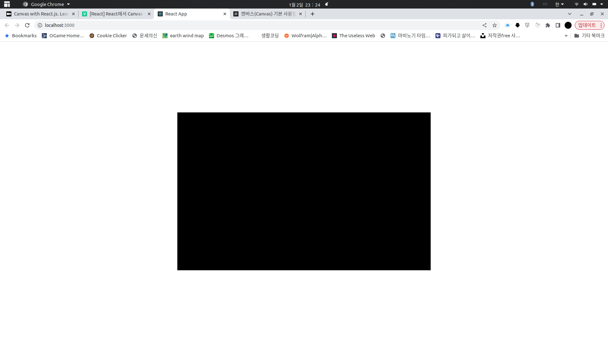

# canvas

- [canvas](#canvas)
    - [drawing](#drawing)

canvas는 html문서 내부에 그림을 그릴 수 있는 컨테이너 엘리먼트다. canvas는 자바스크립트를 통해 그림을 그리고 애니메이션과 이벤트 처리등을 가능하게 해준다.

JS의 경우는 `getElementById`를 이용하여 `canvas 태그`에 접근하지만, 가상 돔을 사용하는 리액트는 `useRef()`훅을 통해 canvas에 접근한다.

```javascript
import React, { useEffect, useRef } from 'react';
import styled from 'styled-components';

function App() {
  const canvasRef = useRef(null);

  useEffect(() => {
    const canvas = canvasRef.current;
    canvas.width = 800;
    canvas.height = 500;
    const context = canvas.getContext('2d');
    context.fillStyle = '#000000';
    context.fillRect(0, 0, context.canvas.width, context.canvas.height);
  }, []);

  return <Canvas ref={canvasRef} />;
}

const Canvas = styled.canvas`
  position: absolute;
  left: 50%;
  top: 50%;
  transform: translate(-50%, -50%);
`;

export default App;
```



`canvas`객체가 잘 작성이 된 모습이다.

## drawing

```javascript
import React, { useEffect, useRef, useState } from 'react';
import styled from 'styled-components';

function App() {
  const canvasRef = useRef(null);
  const contextRef = useRef(null);

  const [ctx, setCtx] = useState();
  const [isDrawing, setIsDrawing] = useState();

  useEffect(() => {
    const canvas = canvasRef.current;
    canvas.width = 800;
    canvas.height = 500;

    const context = canvas.getContext('2d');
    context.strokeStyle = 'white';
    context.lineWidth = 2.5;
    context.fillStyle = '#000000';
    context.fillRect(0, 0, context.canvas.width, context.canvas.height);
    contextRef.current = context;

    setCtx(context);
  }, []);

  const startDrawing = () => {
    setIsDrawing(true);
  };

  const finishDrawing = () => {
    setIsDrawing(false);
  };

  const drawing = ({ nativeEvent }) => {
    const { offsetX, offsetY } = nativeEvent;

    if (ctx) {
      if (!isDrawing) {
        ctx.beginPath();
        ctx.moveTo(offsetX, offsetY);
        console.log(ctx);
      } else {
        ctx.lineTo(offsetX, offsetY);
        ctx.stroke();
        console.log(ctx);
      }
    }
  };
  return (
    <Canvas
      ref={canvasRef}
      onMouseDown={startDrawing}
      onMouseUp={finishDrawing}
      onMouseMove={(event) => drawing(event)}
      onMouseLeave={finishDrawing}
    />
  );
}

const Canvas = styled.canvas`
  position: absolute;
  left: 50%;
  top: 50%;
  transform: translate(-50%, -50%);
`;

export default App;
```


그림이 잘 그려지는 것을 확인할 수 있다.

그리기에 사용된 메소드들은 [여기](https://velog.io/@mokyoungg/JS-JS%EC%97%90%EC%84%9C-Canvas-%EC%82%AC%EC%9A%A9%ED%95%98%EA%B8%B0%EB%A7%88%EC%9A%B0%EC%8A%A4%EB%A1%9C-%EA%B7%B8%EB%A6%AC%EA%B8%B0#htmlcanvaselementgetcontext)에서 확인할 수 있다.
