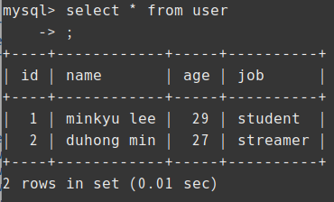
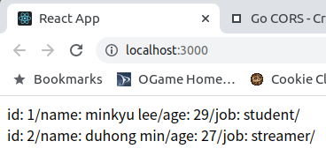

# go로 서버를 만들어보자

- [DB 연동하기](#DB-연동하기)
- [API 서버 만들기](#API-서버-만들기)

## DB 연동하기

가장 먼저 go module을 만들어주어야 한다.

```bash
# mod 초기화 및 go.mod 파일 생성
go mod init {package name}

# go.sum 파일 생성
go build 

# 소스내 의존성을 go.mod 파일에 정리
go tidy

# go.sum 파일 유효성 검사
go mod verify
```

그리고 프로젝트의 루트 디렉토리로 가서 mysql의 드라이버를 설치하자.

```bash
go get github.com/go-sql-driver/mysql 
```

***

다음과 같은 디렉토리 구조를 만들고, 

```
simple_server
├── database
│   ├── connectUser.go
│   └── go.mod
├── go.mod
├── go.sum
└── main.go
```

database 폴더를 module화 시킨 다음에 main이 있는 go.mod를 다음과 같이 작성한다.

```
module simple_server

go 1.20

require simple_server.com/database v0.0.0

require github.com/go-sql-driver/mysql v1.7.0 // indirect

replace simple_server.com/database v0.0.0 => ./database
```

이제 database가 모듈화되었고, main.go에서 import해와 사용할 수 있게 되었다!

***

connection pool을 설정해주자.

```mysql
set global max_connections = 10
set global max_user_connections = 6
```

현재 DB에는 TESTDB의 user테이블에 다음과 같은 데이터가 있다.

```
+----+------------+-----+---------+
| id | name       | age | job     |
+----+------------+-----+---------+
|  1 | minkyu lee |  29 | student |
+----+------------+-----+---------+
```

이제 이 데이터를 go로 가져와보자.

***

먼저, user 테이블과 connect하기 위해 connectUser.go라는 파일을 만들고 다음과 같이 작성한다.

```go
// connectUser.go
package connectUser

import (
	"database/sql"

	_ "github.com/go-sql-driver/mysql"

	"fmt"

	"log"
)

func Connect(){
	db, err := sql.Open("mysql", "testuser:test@tcp(127.0.0.1:3306)/TESTDB")

	if err != nil{
		log.Fatal(err)
	}

	conn, err := db.Query("SELECT * FROM user")

	if err != nil{
		log.Fatal(err)
	}

	for conn.Next(){
		id := ""
		name := ""
		age := ""
		job := ""
		if err := conn.Scan(&id, &name, &age, &job); err != nil {
			fmt.Println(err)
		}
		fmt.Println(id, name, age, job)
	}
	conn.Close()

	db.Close()
}
```

그리고 main.go에서 해당 모듈을 import해서 호출해주면 된다.

```go
// main.go
package main

import connectUser "simple_server.com/database"

func main() {
    connectUser.Connect();
}
```

실행시키면, 다음과 같이 출력된다!

> 1 minkyu lee 29 student

## API 서버 만들기

먼저, connectUser.go를 다음과 같이 수정한다.

```go
// connectUser.go
package connectUser

import (
	"database/sql"
	"encoding/json"

	_ "github.com/go-sql-driver/mysql"

	"fmt"

	"log"
)

type user struct {
	Id int `json:"id"`
	Name string `json:"name"`
	Age int `json:"age"`
	Job string `json:"job"`
}

func newUser(id int, name string, age int, job string) *user{
	u := user{}
	u.Id = id;
	u.Name = name;
	u.Age = age;
	u.Job = job;
	return &u
}

func GetUsers() []byte{
	db, err := sql.Open("mysql", "testuser:test@tcp(127.0.0.1:3306)/TESTDB")

	if err != nil{
		log.Fatal(err)
	}

	rows, err := db.Query("SELECT * FROM user")

	if err != nil{
		log.Fatal(err)
	}

	// cols, _ := rows.Columns()

	ret := make([]interface{},0)

	for rows.Next(){
		u := newUser(0,"",0,"")
		if err := rows.Scan(&u.Id, &u.Name, &u.Age, &u.Job); err != nil {
			fmt.Println(err)
		}
		if err != nil {
			fmt.Println(err)
		}
		ret =append(ret,u)
	}
	rows.Close()

	db.Close()
	response, err := json.Marshal(ret)
	if err != nil{
		fmt.Println(err)
	}
	
	return response;
}
```

구조체를 만들고, 초기화하는 함수를 작성한다. 그리고 db connection을 만들고 SELECT를 하여 데이터를 가져온다.

데이터들을 ret Slice에 차례대로 추가하고 최종적으로 json으로 변환하여 리턴해주면 된다!

그리고 main.go를 다음과 같이 수정한다.

```go
// main.go
package main

import (
	"net/http"

	"github.com/rs/cors"

	connectUser "simple_server.com/database"
)

func main() {
    serveMux := http.NewServeMux()

    serveMux.HandleFunc("/api/data", func(rw http.ResponseWriter, r *http.Request){
        rw.WriteHeader(http.StatusCreated)
        rw.Header().Set("Content-Type", "application/json")
        rw.Write([]byte(connectUser.GetUsers()))
    })

    handler := cors.Default().Handler(serveMux)

    corHandler := cors.New(cors.Options{
        AllowedOrigins:   []string{"http://localhost:3000"},
	AllowedMethods:   []string{"*"},
	AllowedHeaders:   []string{"*"},
	AllowCredentials: true,
	MaxAge:           0,
	Debug:            true,
    })

    handler = corHandler.Handler(handler)

    http.ListenAndServe(":3001", handler)
}
```

header에 상태코드와 데이터 타입을 추가하고 body에 db에서 꺼내온 데이터를 추가해서 클라이언트로 보낸다.

go cors handler 라이브러리를 사용해 localhost를 허용해주고 클라이언트에서 api요청을 보내면



위와 같은 DB의 데이터가



다음과 같이 클라이언트에 제대로 받아와 진 것을 확인할 수 있다!
