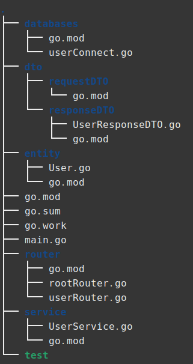

# go로 서버를 만들어보자 #2

- [entity, DTO, 로직 분리](#entity-DTO-로직 분리)
  - [entity](#entity)
  - [dto](#dto)
  - [database](#database)
  - [service](#service)
  - [router](#router)

## entity, DTO, 로직 분리

DB로부터 데이터를 가져오는 entity, user와 관련된 dto, 그리고 서버의 로직을 분리시켜보자.

가장 먼저, 디렉토리 구조를 다음과 같이 바꿔준다.



### entity

DB에서 데이터를 가져올 entity이다.

```go
package entity

type User struct {
	Id int
	Name string
	Age int
	Job string
}
```

### dto

다음으로는 서비스 로직에서 router로 보낼 UserResponseDTO이다.

```go
type UserResponseDTO struct {
	Id int `json:"id"`
	Name string `json:"name"`
	Age int `json:"age"`
	Job string `json:"job"`
}
```

서비스 로직에서 데이터를 처리하지 않기 때문에 entity와 동일하다.

### database

DB에서 user테이블의 데이터를 꺼내오는 userConnect.go 파일이다.

```go
package databases

import (
	"database/sql"

	_ "github.com/go-sql-driver/mysql"

	"fmt"

	"log"

	"entity"
)

func GetAllUsers() []entity.User{
	db, err := sql.Open("mysql", "testuser:test@tcp(127.0.0.1:3306)/TESTDB")

	if err != nil{
		log.Fatal(err)
	}

	rows, err := db.Query("SELECT * FROM user")

	if err != nil{
		log.Fatal(err)
	}

	ret := make([]entity.User,0)

	for rows.Next(){
		u := entity.User{}
		if err := rows.Scan(&u.Id, &u.Name, &u.Age, &u.Job); err != nil {
			fmt.Println(err)
		}
		ret =append(ret,u)
	}
	rows.Close()

	db.Close()

	return ret;
}
```

이전의 코드와 다른 점은, 이전엔 json으로 변환하여 return하였는데 지음은 그냥 entity채로 return한다.

### service

user entity를 받아 데이터를 처리하는 UserService.go이다.

```go
package service

import (
	"databases"
	"responseDTO"
)

func GetUser() []responseDTO.UserResponseDTO{
	users := databases.GetAllUsers()

	ret := make([]responseDTO.UserResponseDTO,0)
	for i := 0; i<len(users); i++{
		u := responseDTO.UserResponseDTO{}

		u.Id = users[i].Id
		u.Age = users[i].Age
		u.Job = users[i].Job
		u.Name = users[i].Name

		ret = append(ret, u)
	}
	
	return ret;
}
```

entity를 단순히 UserResponseDTO로 변환시켜주고 return하는 역할만 한다.

### router

client에게 user데이터를 전송하는 userRouter이다.

```go
package router

import (
	"encoding/json"
	"log"
	"net/http"
	"service"
)

func UserRouter(serveMux *http.ServeMux){
	serveMux.HandleFunc("/api/data", func(rw http.ResponseWriter, r *http.Request){
        rw.WriteHeader(http.StatusCreated)
        rw.Header().Set("Content-Type", "application/json")

        response, err := json.Marshal(service.GetUser())

        if err != nil{
            log.Fatal(err)
        }

        rw.Write([]byte(response))
    })
}
```

UserResponseDTO를 받아서 json으로 변환한 뒤 클라이언트로 write한다.

rootRouter에서 CORS처리를 한 뒤 클라이언트에서 GET요청을 보내면...


다음과 같은 user테이블이


다음과 같이 출력된다!
